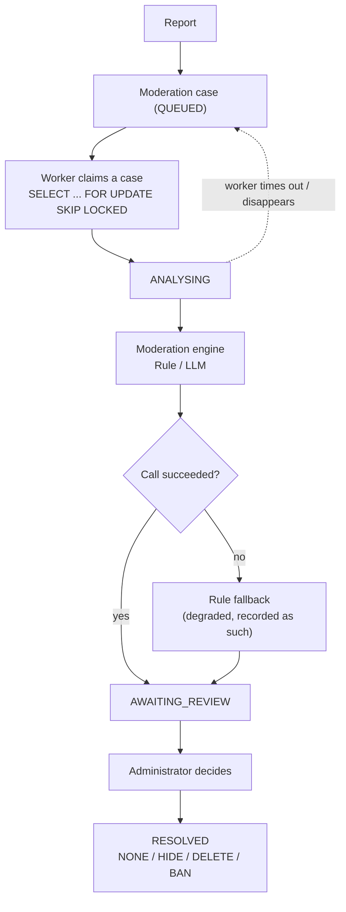

[](README.md)
[](README.zh-CN.md)

# De-Moderation

**De-Moderation is a content moderation backend built for the
[De-discussion](https://github.com/Mingjie-Mao/De-discussion) campus forum,
combining a rule engine with LLM-assisted review while an administrator makes the
final call.**

When a user reports content the system opens a moderation case, a pluggable rule
or LLM engine produces a recommendation, and a human completes the decision.

Java 21 · Spring Boot 3.5 · PostgreSQL 16 · Spring AI (Gemini) · Testcontainers

[Architecture](docs/architecture.md) · [Evaluation](docs/evaluation-notes.md) ·
[Reliability](docs/reliability.md) · [Security](docs/security-decisions.md) ·
[Demo script](docs/demo-script.md)

## Results

Every moderation engine is tested by the same evaluation pipeline, on the same
192-sample bilingual labelled dataset.

| Engine | Macro-F1 | ALLOW Recall | REMOVE Recall | ESCALATE Recall | p50 Latency | Tokens/sample |
|---|---|---|---|---|---|---|
| `keyword-v1` — term list | 0.286 | 1.000 | 0.106 | 0.000 | 0.05 ms | — |
| `gemini-3.5-flash-lite/v1` | 0.617 | 0.978 | 0.939 | 0.056 | 906 ms | 341 |
| `gemini-3.5-flash-lite/v2` | **0.924** | 0.989 | 0.970 | **0.778** | 868 ms | 651 |

v1 and v2 use the same model and the same Java code; only the prompt changed.
Rewriting it took Macro-F1 from 0.617 to 0.924 and ESCALATE Recall from 0.056 to
0.778, at the cost of average prompt token usage rising from 341 to 651.

**Note:** v2 was written after inspecting v1's errors on this same dataset, so
0.924 is not an unbiased held-out estimate. Per-sample disagreements, the
English/Chinese split and the remaining limits are in the
[evaluation notes](docs/evaluation-notes.md).

## Architecture



**Design principles**
- **Human-in-the-loop:** an engine only produces a recommendation, a confidence
  and a rationale; the final action is always an administrator's.
- **Fail-safe moderation:** when the model is unavailable, times out, is rate
  limited or returns output that fails validation, the system degrades to the
  rule engine so moderation never stops.

Repeated reports on one target collapse into a single moderation case, and a
database unique constraint guarantees only one engine call. Cases left behind by
a worker that exited abnormally are automatically requeued; every state
transition, verdict and administrator action is written to an append-only audit
log.

## Features

- **Forum API** — posts, threaded comments and a feed, with JWT authentication
  and cursor pagination
- **Report aggregation** — repeated reports on one target become a single case,
  avoiding duplicate engine calls
- **Durable moderation queue** — concurrent claiming via
  `SELECT ... FOR UPDATE SKIP LOCKED`, plus recovery of cases from failed workers
- **Pluggable moderation engines** — the rule engine and the LLM share one
  interface, registered and evaluated independently as `model/prompt-version`
- **Reliable LLM call chain** — structured-output validation, corrective retry,
  timeout, circuit breaking, rate-limit backoff and rule-engine fallback
- **Evaluation framework** — Macro-F1, per-class recall, latency and token usage
  computed uniformly, with per-sample disagreement analysis
- **Audit log** — case transitions, engine verdicts and administrator actions
- **Automated tests** — 157 tests, including PostgreSQL integration tests on
  Testcontainers

## Quick start

Requires JDK 21 and Docker, or a compatible container runtime.

Copy the environment template:

```bash
cp .env.example .env
```

Fill in `DB_PASSWORD` in `.env`, and generate a `JWT_SECRET`:

```bash
openssl rand -hex 32
```

Start the database and run the application:

```bash
docker compose up -d
set -a && . ./.env && set +a
mvn spring-boot:run
```

Once running, [Swagger UI](http://localhost:8080/swagger-ui.html) is where the
API is called and tested, the administrator moderation flow included. This
project is backend moderation infrastructure, so no separate administrator front
end was built.

### API permissions

| Endpoint | Access |
|---|---|
| `POST /api/auth/register` · `/login` | public |
| `GET /api/posts` · `/{id}` · `/{id}/comments` | public |
| `POST /api/posts` · `/{id}/comments` · `/api/reports` | signed-in users |
| `DELETE /api/posts/{id}` | the author, or an administrator |
| `GET\|POST /api/admin/moderation-cases/**` | administrators only |

The administrator role is not granted through any public API; it is configured
directly in the database.

## AI-assisted moderation

LLM moderation is optional. With `AI_CHAT_MODEL` unset the model engine is never
registered and everything else runs normally.

Add to `.env`:

```bash
printf 'AI_CHAT_MODEL=google-genai\nGEMINI_MODELS=gemini-3.5-flash-lite\nMODERATION_ENGINE=gemini-3.5-flash-lite/v2\nGEMINI_API_KEY=...\n' >> .env
```

The model and the prompt version together form an engine's identity — for
example `gemini-3.5-flash-lite/v2` — so different prompts are registered,
evaluated and compared independently.

The LLM call chain includes:

- **One engine interface** — the rule engine and the LLM share it, decoupling the
  model implementation from the core moderation flow
- **Structured-output validation** — the decision, confidence and rule codes are
  checked, and invalid output triggers one corrective retry
- **Timeout and circuit breaking** — a persistently failing model fails fast
  rather than blocking the moderation queue
- **Rate-limit backoff** — exponential backoff for recoverable throttling
- **Rule-engine fallback** — a model that fails for good falls back to the
  deterministic engine
- **Invocation records** — `ai_invocations` holds model, prompt version, token
  usage, latency, status and the raw response

More implementation detail in [reliability.md](docs/reliability.md).

## Testing

Run the full suite:

```bash
mvn verify
```

The project has **157 automated tests** and runs its integration tests against a
real PostgreSQL through Testcontainers, covering concurrent report aggregation,
database constraints, moderation queue recovery and model degradation.

## Dataset

The evaluation set is **192 bilingual labelled samples**, and contains no real
production traffic.

The benign samples come from the forum demo content of an earlier ANU team
project, [De-discussion](https://github.com/Mingjie-Mao/De-discussion); the
violating and borderline samples were written specifically for this evaluation.

## Documentation

| | |
|---|---|
| [architecture.md](docs/architecture.md) | components, data model, request flow |
| [evaluation-notes.md](docs/evaluation-notes.md) | what the numbers mean, and what they do not |
| [evaluation.md](docs/evaluation.md) | the generated report — metrics, confusion matrices, per-sample disagreements |
| [reliability.md](docs/reliability.md) | queue durability, degradation, bounds |
| [security-decisions.md](docs/security-decisions.md) | authentication, exposure, privilege |
| [demo-script.md](docs/demo-script.md) | a three-minute walkthrough |
