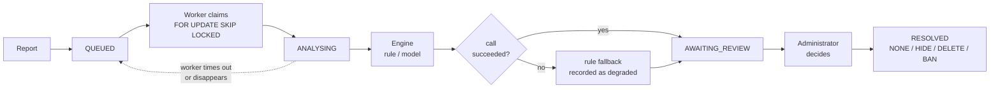
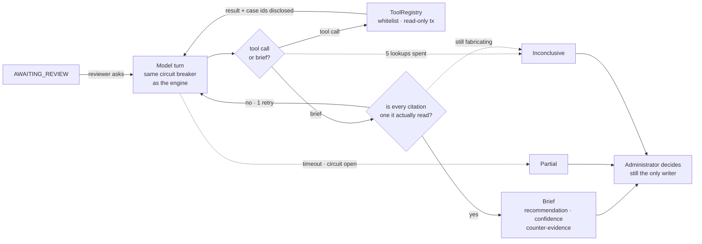

[](README.md)
[](README.zh-CN.md)

# De-Moderation

**De-Moderation is a content moderation backend built for the
[De-discussion](https://github.com/Mingjie-Mao/De-discussion) campus forum,
combining a rule engine with LLM-assisted review while an administrator makes the
final call.**

When a user reports content the system opens a moderation case, a pluggable rule
or LLM engine produces a recommendation, and a human completes the decision.

Java 21 · Spring Boot 3.5 · PostgreSQL 16 · Spring AI (Gemini) · Testcontainers

[Architecture](docs/architecture.md) · [Evaluation](docs/evaluation-notes.md) ·
[Reliability](docs/reliability.md) · [Security](docs/security-decisions.md) ·
[Production](docs/production-runbook.md) · [Client guide](docs/api-client-guide.md) ·
[Demo script](docs/demo-script.md) · [Full backend report](docs/backend-project-report.md)

## Results

Every moderation engine is tested by the same evaluation pipeline, on two
bilingual labelled datasets.

**The 192-sample set**, which the prompts were written against:

| Engine | Macro-F1 | ALLOW Recall | REMOVE Recall | ESCALATE Recall | p50 Latency | Tokens/sample |
|---|---|---|---|---|---|---|
| `keyword-v1` — term list | 0.286 | 1.000 | 0.106 | 0.000 | 0.05 ms | — |
| `gemini-3.5-flash-lite/v1` | 0.617 | 0.978 | 0.939 | 0.056 | 906 ms | 341 |
| `gemini-3.5-flash-lite/v2` | **0.924** | 0.989 | 0.970 | **0.778** | 868 ms | 651 |

v1 and v2 use the same model and the same Java code; only the prompt changed.
Rewriting it took Macro-F1 from 0.617 to 0.924 and ESCALATE Recall from 0.056 to
0.778, at the cost of average prompt token usage rising from 341 to 651.

v2 was written after inspecting v1's errors on this same data, so 0.924 is a
diagnosis confirmed on the data that produced it, not an estimate.

**The 72-sample held-out set**, written afterwards and never read while writing
any prompt. 36 minimal pairs: one post written twice with a single deliberate
difference, where the two halves get different correct answers. Each engine run
three times; `±` is half the observed range.

| Engine | Macro-F1 | ESCALATE Recall | Pair accuracy | Changed answer |
|---|---|---|---|---|
| `keyword-v1` — term list | 0.217 ±0.000 | 0.000 | **0.000** | 0 / 72 |
| `gemini-3.5-flash-lite/v1` | 0.597 ±0.016 | 0.067 | 0.457 | 2 / 72 |
| `gemini-3.5-flash-lite/v2` | **0.984** ±0.003 | 1.000 | **0.972** | 0 / 72 |

A pair counts as right only if both halves are. An engine answering by topic gets
one half of every pair for free — which is what the term list's 0.000 is, on 36
pairs it answered 29 of identically.

**What these two tables establish, and what they do not.** v1's ESCALATE collapse
reproduces on data written five weeks later (0.056 → 0.067), so the failure that
justified the rewrite was real and not an artefact. v2's single error on the
held-out set is one its own source comments had predicted and left unfixed. But
0.984 is **not** an estimate of live accuracy: the held-out labels were written
from the same policy v2's prompt states, so its perfect ESCALATE recall is close
to definitional. Neither set is real traffic. The full argument is in the
[evaluation notes](docs/evaluation-notes.md).

**A third prompt, `v3`,** adds one line to `v2` fixing the language the rationale
is written in — the explanation a reviewer reads, which was arriving in English
under Chinese threads. Measured against the same 72 samples a day later, three
runs, it classifies *identically* to `v2`: macro-F1 0.986 for both, pair accuracy
0.972 for both, nothing fixed and nothing broken across all 72, and the same
single miss. On the set's 28 Chinese samples — in the run each report is drawn
from — it wrote a Chinese rationale 28 times against `v2`'s 3, for 11.6% more
prompt tokens. Free in accuracy, paid for
in prompt size. That session also re-measured `v2` at 0.986 against the previous
day's 0.984, a gap inside the first day's own range —
[the report](docs/evaluation-heldout-v2v3.md).

## Architecture



**Design principles**
- **Human-in-the-loop:** an engine only produces a recommendation, a confidence
  and a rationale; the final action is always an administrator's.
- **Correctable:** resolved cases support re-decision and appeal. Effects of a
  prior decision can be undone, and every change is appended to the audit trail.
- **Fail-safe moderation:** an external model failure never blocks the review
  workflow.

Repeated reports on one target collapse into a single moderation case, and a
database unique constraint guarantees only one engine call. Cases left behind by
a worker that exited abnormally are automatically requeued; every state
transition, verdict and administrator action is written to an append-only audit
log.

### Case investigation

The pipeline above decides one piece of content at a time. What it cannot tell a
reviewer is whether this is the author's first offence or their fourth, or how
the same rule has been enforced before — cases are keyed by the content they
concern, so there was no path from a person to their history.

A reviewer can ask an assistant to go and find out. It is a second, optional
path hanging off `AWAITING_REVIEW`; it moves no case and writes nothing.



Design, measurements, cost queries and known failures are in
[docs/investigation.md](docs/investigation.md).

The four tools are `caseDetail`, `authorHistory`, `similarResolvedCases` and
`ruleText`. Each takes the case under investigation from the caller rather than
from the model's arguments, so there is no way to point one at a different case.

**What is deliberately absent.** No memory: the durable state is PostgreSQL,
with transactions and an audit trail, and a model's private second copy would be
a second answer to questions that must have exactly one. No retrieval: the rule
set is a few dozen entries and fits in a prompt, so a vector store would buy a
new failure mode and nothing else. No autonomy on the main path: the pipeline
above is unchanged, and the evaluation numbers keep meaning what they meant.

A reviewer asks for a brief from the console; nothing starts one on its own, and
opening a case shows one somebody already paid for rather than running a new
one. The brief is written to the audit trail against the administrator who asked
for it.

**Status.** Working end to end and off by default. Measured against
`gemini-3.5-flash-lite` over 16 scenarios run three times each: a moderator could
defend the recommendation in 0.875 of them, the answer was the same every time in
0.938, and it cited what the case turns on in 0.813 — at roughly 3.6 times the
tokens of a verdict. Two failures are reproducible and documented rather than
patched: it will not be the first to escalate, and it anchors on precedent even
when the dismissal rate argues the other way.

The author's record and the precedent for the flagged rules are fetched before
the model is asked anything, rather than left to it to request. That was a fix
for briefs disagreeing between runs — the difference tracked whether the model
had happened to look up precedent that turn — and it halved the tokens as a side
effect, since the brief is now usually written in a single call.

**Known.** Two of the three cases became identical across runs; one still flips
between a ban and a takedown. That remainder is the model's own output varying
at temperature 0, which no change to the loop can remove. What makes it
survivable is that a case is investigated once and the brief is stored, so two
reviewers comparing notes are reading the same one.

Supplying precedent every time also anchors on it: a case that sometimes got
NONE when the model had judged the content alone now follows the precedent it is
always shown. That is a real trade, not a free win.

## Features

- **Forum and user API** — posts, threaded comments, profiles, cursor pagination,
  normalized images and notifications
- **Secure sessions** — JWT, rotating refresh tokens, instant invalidation,
  password change/reset and persistent authentication throttling
- **Durable moderation workflow** — report aggregation, a persistent case queue,
  concurrent workers and recovery of abandoned cases
- **Pluggable moderation engines** — rule and LLM engines share one interface and
  are evaluated independently by model and prompt version
- **LLM reliability** — output validation, timeout, circuit breaking,
  rate-limit backoff and deterministic fallback
- **Human-in-the-loop review** — claim, evidence, decisions, correction, appeal,
  notifications and an append-only audit trail
- **Durable media** — one storage seam with a filesystem and an S3-compatible
  backend (AWS, R2, GCS), and an orphan sweep that never touches media belonging
  to content a moderator might reinstate
- **Deployment and observability** — Docker, TLS, Prometheus, Alertmanager with
  severity routing, Grafana, verified off-site backup, a restore drill that is
  safe to run on a working day, CI, and Kubernetes and k6 templates

## Quick start

Requires JDK 21 and Docker, or a compatible container runtime.

Copy the environment template:

```bash
cp .env.example .env
```

Fill in `DB_PASSWORD` in `.env`, and generate a `JWT_SECRET`:

```bash
openssl rand -hex 32
```

Start the database, backend and local reviewer console:

```bash
docker compose up -d
set -a && . ./.env && set +a
mvn spring-boot:run
(cd admin-web && npm ci && npm run dev)
```

Once running, the reviewer console is at [localhost:3000](http://localhost:3000)
and Swagger UI is at [localhost:8080](http://localhost:8080/swagger-ui.html).

### API permissions

| Endpoint | Access |
|---|---|
| `POST /api/auth/register` · `/login` · `/refresh` · password reset | public |
| `GET /api/moderation/status` | public; active engine capability only |
| `GET /api/posts` · `/{id}` · `/{id}/comments` | public |
| Posts/comments create, edit and delete; media, reports, appeals, notifications | signed-in users (ownership enforced) |
| `GET\|POST /api/admin/moderation-cases/**` | administrators only |

The administrator role is not granted through any public API. Set
`ADMIN_USERNAME` and `ADMIN_PASSWORD` in `.env` and that account is created with
the `ADMIN` role at startup.

The initializer only creates a missing username; it never promotes an existing
account or overwrites an existing password.

## AI-assisted moderation

LLM moderation is optional. With `AI_CHAT_MODEL` unset the model engine is never
registered and everything else runs normally.

Add to `.env`:

```bash
printf 'AI_CHAT_MODEL=google-genai\nGEMINI_MODELS=gemini-3.5-flash-lite\nMODERATION_ENGINE=gemini-3.5-flash-lite/v3\nGEMINI_API_KEY=...\n' >> .env
```

The model and the prompt version together form an engine's identity — for
example `gemini-3.5-flash-lite/v3` — so different prompts are registered,
evaluated and compared independently.

The LLM call chain includes:

- **One engine interface** — the rule engine and the LLM share it, decoupling the
  model implementation from the core moderation flow
- **Structured-output validation** — the decision, confidence and rule codes are
  checked, and invalid output triggers one corrective retry
- **Timeout and circuit breaking** — a persistently failing model fails fast
  rather than blocking the moderation queue
- **Rate-limit backoff** — exponential backoff for recoverable throttling
- **Rule-engine fallback** — a model that fails for good falls back to the
  deterministic engine
- **Invocation records** — `ai_invocations` holds model, prompt version, token
  usage, latency, status and the raw response

The De-discussion Android client reads and writes forum content through this API;
administrator review and credential management are handled by the separate
browser console.

More implementation detail in [reliability.md](docs/reliability.md).

## Testing

Run the full suite:

```bash
mvn verify
```

The suite runs its integration tests against real PostgreSQL **and real MinIO**
through Testcontainers, so Docker is a prerequisite. It covers concurrent
aggregation, session rotation, media, assignment, appeals, queue recovery, model
degradation, the investigation loop against a scripted model, the orphan sweep,
and one storage contract that both media backends have to satisfy identically.

Two suites are skipped unless `GEMINI_API_KEY` is set: they call a real model.

The current test count is printed by `mvn verify` and is kept out of prose so it
cannot silently go stale.

## Datasets

Neither set is real production traffic, and neither becomes real traffic by being
harder.

**192 samples**, the set the prompts were written against. The benign samples come
from the forum demo content of an earlier ANU team project,
[De-discussion](https://github.com/Mingjie-Mao/De-discussion); the violating and
borderline samples were written specifically for this evaluation. Provenance
almost perfectly predicts the label there, which is the flaw the second set
exists to remove.

**72 samples**, held out: written after the prompts were frozen, never read while
writing one, and arranged as 36 minimal pairs with one author, one register and
all three labels. Every sample carries a note saying what the edit was and which
clause of the policy the label follows from, so a disputed label is settleable by
reading. Its own invariants — every pair complete, every pair's halves
disagreeing, no overlap with the tuning set — are asserted by `HeldOutDatasetTest`
rather than trusted.

## Documentation

| | |
|---|---|
| [architecture.md](docs/architecture.md) | components, data model, request flow |
| [evaluation-notes.md](docs/evaluation-notes.md) | what the numbers mean, and what they do not |
| [evaluation.md](docs/evaluation.md) | the generated report on the 192-sample set |
| [evaluation-heldout.md](docs/evaluation-heldout.md) | the generated report on the held-out set — pair scores and run-to-run spread |
| [evaluation-heldout-v2v3.md](docs/evaluation-heldout-v2v3.md) | the same set a day later, with `v3` in place of `v1` — what the rationale-language change cost |
| [investigation.md](docs/investigation.md) | the case-investigation assistant: design, measurements, cost and known failures |
| [reliability.md](docs/reliability.md) | queue durability, degradation, bounds |
| [security-decisions.md](docs/security-decisions.md) | authentication, exposure, privilege |
| [demo-script.md](docs/demo-script.md) | a three-minute walkthrough |
| [api-client-guide.md](docs/api-client-guide.md) | Android/browser integration and token/media flows |
| [production-runbook.md](docs/production-runbook.md) | release, TLS, monitoring, backup and incident response |
| [backend-project-report.md](docs/backend-project-report.md) | complete backend design, implementation, evaluation and remaining work |
| [backend-project-report.zh-CN.md](docs/backend-project-report.zh-CN.md) | complete backend report in Chinese |
