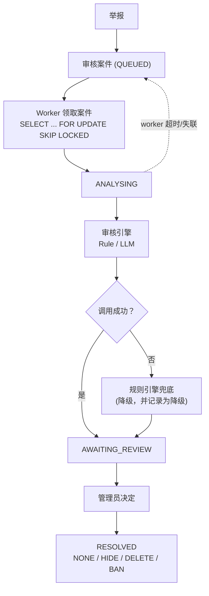

[](README.md)
[](README.zh-CN.md)

# De-Moderation

**De-Moderation 是面向 [De-discussion](https://github.com/Mingjie-Mao/De-discussion) 校园论坛开发的内容审核后端，结合规则引擎与 LLM 辅助审核，并由管理员完成最终处置。**

用户举报内容后，系统创建审核案件，由可插拔的规则或 LLM 引擎生成审核建议，并通过人工复核完成最终处理。

Java 21 · Spring Boot 3.5 · PostgreSQL 16 · Spring AI (Gemini) · Testcontainers

[架构](docs/architecture.md) · [评测解读](docs/evaluation-notes.md) ·
[可靠性](docs/reliability.md) · [安全决策](docs/security-decisions.md) ·
[演示脚本](docs/demo-script.md)

## 结果

所有审核引擎均使用同一套评测流程，在同一份 192 条中英双语标注数据集上测试。

| 引擎 | Macro-F1 | ALLOW 召回 | REMOVE 召回 | ESCALATE 召回 | p50 延迟 | Token/样本 |
|---|---|---|---|---|---|---|
| `keyword-v1` — 词表 | 0.286 | 1.000 | 0.106 | 0.000 | 0.05 ms | — |
| `gemini-3.5-flash-lite/v1` | 0.617 | 0.978 | 0.939 | 0.056 | 906 ms | 341 |
| `gemini-3.5-flash-lite/v2` | **0.924** | 0.989 | 0.970 | **0.778** | 868 ms | 651 |

v1 与 v2 使用相同模型和相同 Java 代码，仅修改了 prompt。改写后 Macro-F1 从 0.617 提升至 0.924，ESCALATE Recall 从 0.056 提升至 0.778；代价是平均 prompt token 使用量从 341 增加至 651。

**说明：** v2 的措辞是读完 v1 在同一份数据集上的错误之后写的，所以 0.924 不是留出测试集的无偏估计。逐样本分歧、中英拆分和其余限制都在[评测解读](docs/evaluation-notes.md)里。

## 架构



**设计原则**
- **Human-in-the-loop：** 审核引擎只生成建议、置信度和理由，最终处置始终由管理员决定。
- **可修改：** 已处置的案件可以重新处置。系统会先撤销上一次处置的影响——恢复被隐藏的内容、
  解封被封禁的作者——除非新的处置同样需要它；修改会以追加方式写入审计日志，而不是覆盖原记录。
  管理端仍然可以看到已被隐藏的内容，因为重新评估一次删除必须先读到它。
- **Fail-safe moderation：** 模型不可用、超时、限流或输出校验失败时自动降级到规则引擎，保证审核流程不中断。

同一目标的重复举报会合并为单个审核案件，并由数据库唯一约束保证只触发一次引擎调用。Worker 异常退出后，未完成案件会自动重新入队；所有状态流转、审核结果和管理员操作均写入只追加的审计日志。

## 功能

- **论坛 API** —— 帖子、树形评论与信息流，支持 JWT 认证和游标分页
- **举报聚合** —— 同一目标的重复举报合并为单个审核案件，避免重复引擎调用
- **持久审核队列** —— 基于 `SELECT ... FOR UPDATE SKIP LOCKED` 并发领取，并支持异常 Worker 的案件回收
- **可插拔审核引擎** —— 规则引擎与 LLM 共享统一接口，支持按 `模型/prompt版本` 独立注册和评测
- **可靠的 LLM 调用链** —— 结构化输出校验、校正重试、超时、熔断、限流退避与规则引擎降级
- **评测框架** —— 统一计算 Macro-F1、分类 Recall、延迟与 Token 使用，并生成逐样本分歧分析
- **审计日志** —— 记录案件状态流转、引擎判决和管理员操作
- **自动化测试** —— 157 个测试，包括基于 Testcontainers 的 PostgreSQL 集成测试

## 快速开始

需要 JDK 21 和 Docker（或兼容的容器运行时）。

复制环境变量模板：

```bash
cp .env.example .env
```

在 `.env` 中填写 `DB_PASSWORD`，并生成 `JWT_SECRET`：

```bash
openssl rand -hex 32
```

启动数据库并运行应用：

```bash
docker compose up -d
set -a && . ./.env && set +a
mvn spring-boot:run
```

启动后可访问 [Swagger UI](http://localhost:8080/swagger-ui.html) 调用和测试 API，包括管理员审核流程。本项目重点是后端审核基础设施，因此没有单独实现管理端前端。

### API 权限

| 接口 | 权限 |
|---|---|
| `POST /api/auth/register` · `/login` | 公开 |
| `GET /api/moderation/status` | 公开；只暴露实际启用的引擎能力 |
| `GET /api/posts` · `/{id}` · `/{id}/comments` | 公开 |
| `POST /api/posts` · `/{id}/comments` · `/api/reports` | 已登录用户 |
| `DELETE /api/posts/{id}` | 作者或管理员 |
| `GET\|POST /api/admin/moderation-cases/**` | 仅管理员 |

管理员角色不通过公开 API 授予。在 `.env` 中设置 `ADMIN_USERNAME` 和
`ADMIN_PASSWORD`，该账号会在启动时以 `ADMIN` 角色创建。

只创建，不修改。如果该用户名已存在，则完全不做改动——因此填入一个别人已注册的用户名
并不会把管理员权限交给对方，**同时之后修改 `ADMIN_PASSWORD` 也不会改掉已存在账号的密码。**

## 模型辅助审核

LLM 审核是可选的。未配置 `AI_CHAT_MODEL` 时，模型引擎不会注册，其余功能仍可正常运行。

在 `.env` 中加入：

```bash
printf 'AI_CHAT_MODEL=google-genai\nGEMINI_MODELS=gemini-3.5-flash-lite\nMODERATION_ENGINE=gemini-3.5-flash-lite/v2\nGEMINI_API_KEY=...\n' >> .env
```

模型与 Prompt 版本共同构成审核引擎身份，例如 `gemini-3.5-flash-lite/v2`，因此不同 Prompt 可以独立注册、评测和比较。

LLM 调用链包含：

- **统一引擎接口** —— 规则引擎与 LLM 使用相同接口，将模型实现与核心审核流程解耦
- **结构化输出校验** —— 校验决策、置信度和规则代码，非法输出触发一次校正重试
- **超时与熔断** —— 模型持续故障时快速失败，避免阻塞审核队列
- **限流退避** —— 对可恢复的限流错误进行指数退避
- **规则引擎降级** —— 模型最终失败时自动回退到确定性规则引擎
- **调用记录** —— `ai_invocations` 记录模型、Prompt 版本、Token 使用、延迟、状态和原始响应

De Android 客户端通过 `GET /api/moderation/status` 明确展示已配置模型是否真的注册并启用，或服务是否已经降级为规则引擎。客户端只在内容被举报时按需镜像内容、向本服务提交举报，并通过管理员 API 读取和处置案件。两个仓库仍是独立应用，不需要共享文件系统，也不需要合并构建。

更多实现细节见 [reliability.md](docs/reliability.md)。

## 测试

运行完整测试：

```bash
mvn verify
```

项目包含 **157 个自动化测试**，并通过 Testcontainers 使用真实 PostgreSQL 运行集成测试，覆盖并发举报聚合、数据库约束、审核队列恢复和模型降级等关键行为。

## 数据集

评测集包含 **192 条中英双语标注样本**，其中不包含真实生产流量。

良性样本来自早期 ANU 团队项目 [De-discussion](https://github.com/Mingjie-Mao/De-discussion) 的论坛演示内容；违规与边界样本则专门为本次评测编写。


## 文档

| | |
|---|---|
| [architecture.md](docs/architecture.md) | 组件、数据模型、请求流转 |
| [evaluation-notes.md](docs/evaluation-notes.md) | 这些数字意味着什么、又不意味着什么 |
| [evaluation.md](docs/evaluation.md) | 自动生成的报告——指标、混淆矩阵、逐样本分歧 |
| [reliability.md](docs/reliability.md) | 队列持久性、降级、各种上界 |
| [security-decisions.md](docs/security-decisions.md) | 认证、暴露面、权限 |
| [demo-script.md](docs/demo-script.md) | 三分钟走查 |
