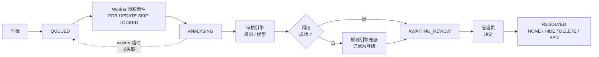
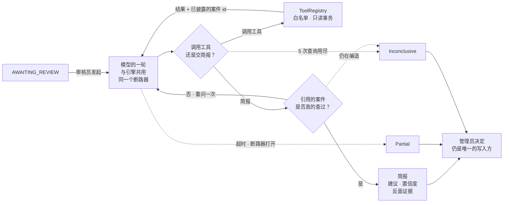

[](README.md)
[](README.zh-CN.md)

# De-Moderation

**De-Moderation 是面向 [De-discussion](https://github.com/Mingjie-Mao/De-discussion) 校园论坛开发的内容审核后端，结合规则引擎与 LLM 辅助审核，并由管理员完成最终处置。**

用户举报内容后，系统创建审核案件，由可插拔的规则或 LLM 引擎生成审核建议，并通过人工复核完成最终处理。

Java 21 · Spring Boot 3.5 · PostgreSQL 16 · Spring AI (Gemini) · Testcontainers

[架构](docs/architecture.md) · [评测解读](docs/evaluation-notes.md) ·
[可靠性](docs/reliability.md) · [安全决策](docs/security-decisions.md) ·
[生产运维](docs/production-runbook.md) · [客户端接入](docs/api-client-guide.md) ·
[演示脚本](docs/demo-script.md) · [完整后端报告](docs/backend-project-report.zh-CN.md)

## 结果

所有审核引擎均使用同一套评测流程，在同一份 192 条中英双语标注数据集上测试。

| 引擎 | Macro-F1 | ALLOW 召回 | REMOVE 召回 | ESCALATE 召回 | p50 延迟 | Token/样本 |
|---|---|---|---|---|---|---|
| `keyword-v1` — 词表 | 0.286 | 1.000 | 0.106 | 0.000 | 0.05 ms | — |
| `gemini-3.5-flash-lite/v1` | 0.617 | 0.978 | 0.939 | 0.056 | 906 ms | 341 |
| `gemini-3.5-flash-lite/v2` | **0.924** | 0.989 | 0.970 | **0.778** | 868 ms | 651 |

v1 与 v2 使用相同模型和相同 Java 代码，仅修改了 prompt。改写后 Macro-F1 从 0.617 提升至 0.924，ESCALATE Recall 从 0.056 提升至 0.778；代价是平均 prompt token 使用量从 341 增加至 651。

**说明：** v2 的措辞是读完 v1 在同一份数据集上的错误之后写的，所以 0.924 不是留出测试集的无偏估计。逐样本分歧、中英拆分和其余限制都在[评测解读](docs/evaluation-notes.md)里。

## 架构



**设计原则**
- **Human-in-the-loop：** 审核引擎只生成建议、置信度和理由，最终处置始终由管理员决定。
- **可纠正：** 已处理案件支持重新裁决和申诉。旧裁决的影响可被撤销，所有修改以追加方式写入审计日志。
- **Fail-safe moderation：** 外部模型失败不会阻塞审核流程。

同一目标的重复举报会合并为单个审核案件，并由数据库唯一约束保证只触发一次引擎调用。Worker 异常退出后，未完成案件会自动重新入队；所有状态流转、审核结果和管理员操作均写入只追加的审计日志。

### 案件调查（进行中）

上面的流水线一次判定一条内容。它没法告诉审核员的是：这是作者的第一次还是第四次，
以及同一条规则以往是怎么执行的——案件按内容索引，从"人"到"他的历史"这条路并不存在。

审核员可以让一个助手去查。它是挂在 `AWAITING_REVIEW` 上的第二条可选路径，
不推动任何案件，也不写入任何东西。



设计、实测数字、成本查询和已知失败都在 [docs/investigation.md](docs/investigation.md)。

四个工具是 `caseDetail`、`authorHistory`、`similarResolvedCases` 和 `ruleText`。
被调查的案件由调用方传入，不走模型的参数，所以没有办法把任何一个工具指向别的案件。

**刻意没做的三件事。** 不做记忆：持久状态在 PostgreSQL 里，有事务也有审计，
模型私存一份等于给只该有一个答案的问题制造第二个答案。不做检索：规则只有几十条，
放得进 prompt，向量库只会换来一种新的失败方式。主链路不引入自主性：
上面的流水线一行未改，已有的评测数字仍然是它原来的意思。

审核员在控制台里主动发起，没有任何东西会自行启动它；打开案件只会显示别人已经付过费的简报，
不会重新跑一次。简报写入审计日志，记在发起它的管理员名下。

**当前状态。** 端到端可用，默认关闭。在 `gemini-3.5-flash-lite` 上用三个证据取向不同的案件测过：
简报在 5 次查询的预算内 2–4 步收敛，token 约为一次判定的四倍，没有出现编造引用。

作者的过往处理记录和涉事规则的先例，在模型被问话之前就由代码取好，不再由它自己决定要不要查。
这是为了修复简报在多次运行之间互相矛盾——差异恰好对应模型那一轮有没有碰巧去查先例——
顺带把 token 减半，因为简报现在通常一次调用就写完。

**已知问题。** 三个案件里两个在多次运行之间完全一致，还有一个仍会在封禁与隐藏之间翻面。
这部分残留是模型自身在 temperature=0 下输出仍有波动，循环层面改不掉。
让它可以接受的是：一个案件只调查一次、简报会被存下来，所以两位审核员对照时读到的是同一份。

每次都供给先例也意味着每次都给一个强先验：某个案件在模型只读内容时有时会判 NONE，
现在则跟随它总能看到的先例。这是一笔实打实的取舍，不是白得的改进。

## 功能

- **论坛与用户 API** —— 帖子、评论、资料、游标分页、图片与通知
- **安全会话** —— JWT、Refresh Token 轮换、即时失效、密码重置与持久化限流
- **持久化审核工作流** —— 举报聚合、案件队列、并发 Worker 与异常案件恢复
- **可插拔审核引擎** —— 规则与 LLM 共用接口，并按模型和 Prompt 版本独立评测
- **LLM 可靠性** —— 输出校验、超时、熔断、限流退避与规则降级
- **Human-in-the-loop** —— 管理员认领、裁决、改判、申诉、通知与审计
- **部署与可观测性** —— Docker、TLS、Prometheus/Grafana、备份脚本、CI，以及 Kubernetes 和 k6 配置模板

## 快速开始

需要 JDK 21 和 Docker（或兼容的容器运行时）。

复制环境变量模板：

```bash
cp .env.example .env
```

在 `.env` 中填写 `DB_PASSWORD`，并生成 `JWT_SECRET`：

```bash
openssl rand -hex 32
```

启动数据库、后端和本地管理端：

```bash
docker compose up -d
set -a && . ./.env && set +a
mvn spring-boot:run
(cd admin-web && npm ci && npm run dev)
```

启动后可访问 [管理端](http://localhost:3000) 处理案件，也可通过
[Swagger UI](http://localhost:8080/swagger-ui.html) 调试 API。

### API 权限

| 接口 | 权限 |
|---|---|
| 注册、登录、刷新令牌、请求/确认密码重置 | 公开 |
| `GET /api/moderation/status` | 公开；只暴露实际启用的引擎能力 |
| `GET /api/posts` · `/{id}` · `/{id}/comments` | 公开 |
| 帖子/评论增删改、媒体、举报、申诉、通知 | 已登录用户，并校验资源所有权 |
| `GET\|POST /api/admin/moderation-cases/**` | 仅管理员 |

管理员角色不通过公开 API 授予。在 `.env` 中设置 `ADMIN_USERNAME` 和
`ADMIN_PASSWORD`，该账号会在启动时以 `ADMIN` 角色创建。

初始化逻辑仅在用户名不存在时创建管理员；不会提升已有账号，也不会覆盖已有密码。

## 模型辅助审核

LLM 审核是可选的。未配置 `AI_CHAT_MODEL` 时，模型引擎不会注册，其余功能仍可正常运行。

在 `.env` 中加入：

```bash
printf 'AI_CHAT_MODEL=google-genai\nGEMINI_MODELS=gemini-3.5-flash-lite\nMODERATION_ENGINE=gemini-3.5-flash-lite/v2\nGEMINI_API_KEY=...\n' >> .env
```

模型与 Prompt 版本共同构成审核引擎身份，例如 `gemini-3.5-flash-lite/v2`，因此不同 Prompt 可以独立注册、评测和比较。

LLM 调用链包含：

- **统一引擎接口** —— 规则引擎与 LLM 使用相同接口，将模型实现与核心审核流程解耦
- **结构化输出校验** —— 校验决策、置信度和规则代码，非法输出触发一次校正重试
- **超时与熔断** —— 模型持续故障时快速失败，避免阻塞审核队列
- **限流退避** —— 对可恢复的限流错误进行指数退避
- **规则引擎降级** —— 模型最终失败时自动回退到确定性规则引擎
- **调用记录** —— `ai_invocations` 记录模型、Prompt 版本、Token 使用、延迟、状态和原始响应

De-discussion Android 客户端通过本 API 读写论坛内容；管理员审核与凭据管理则由独立浏览器管理端完成。

更多实现细节见 [reliability.md](docs/reliability.md)。

## 测试

运行完整测试：

```bash
mvn verify
```

集成测试通过 Testcontainers 使用真实 PostgreSQL，覆盖并发举报聚合、会话轮换、图片、案件认领、申诉、队列恢复和模型降级。当前准确测试数由 `mvn verify` 输出，不再把容易过期的数字写死在说明中。

## 数据集

评测集包含 **192 条中英双语标注样本**，其中不包含真实生产流量。

良性样本来自早期 ANU 团队项目 [De-discussion](https://github.com/Mingjie-Mao/De-discussion) 的论坛演示内容；违规与边界样本则专门为本次评测编写。


## 文档

| | |
|---|---|
| [architecture.md](docs/architecture.md) | 组件、数据模型、请求流转 |
| [evaluation-notes.md](docs/evaluation-notes.md) | 这些数字意味着什么、又不意味着什么 |
| [evaluation.md](docs/evaluation.md) | 自动生成的报告——指标、混淆矩阵、逐样本分歧 |
| [reliability.md](docs/reliability.md) | 队列持久性、降级、各种上界 |
| [security-decisions.md](docs/security-decisions.md) | 认证、暴露面、权限 |
| [demo-script.md](docs/demo-script.md) | 三分钟走查 |
| [api-client-guide.md](docs/api-client-guide.md) | Android/浏览器接入、令牌与媒体流程 |
| [production-runbook.md](docs/production-runbook.md) | 发布、TLS、监控、备份和事故处理 |
| [backend-project-report.zh-CN.md](docs/backend-project-report.zh-CN.md) | 完整后端设计、实现、评测与后续工作 |
| [backend-project-report.md](docs/backend-project-report.md) | 英文版完整后端报告 |
