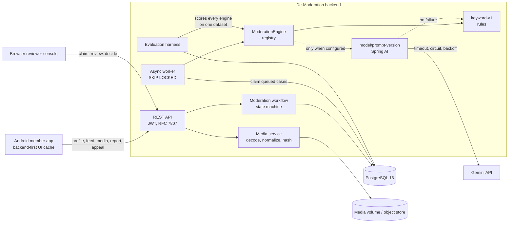
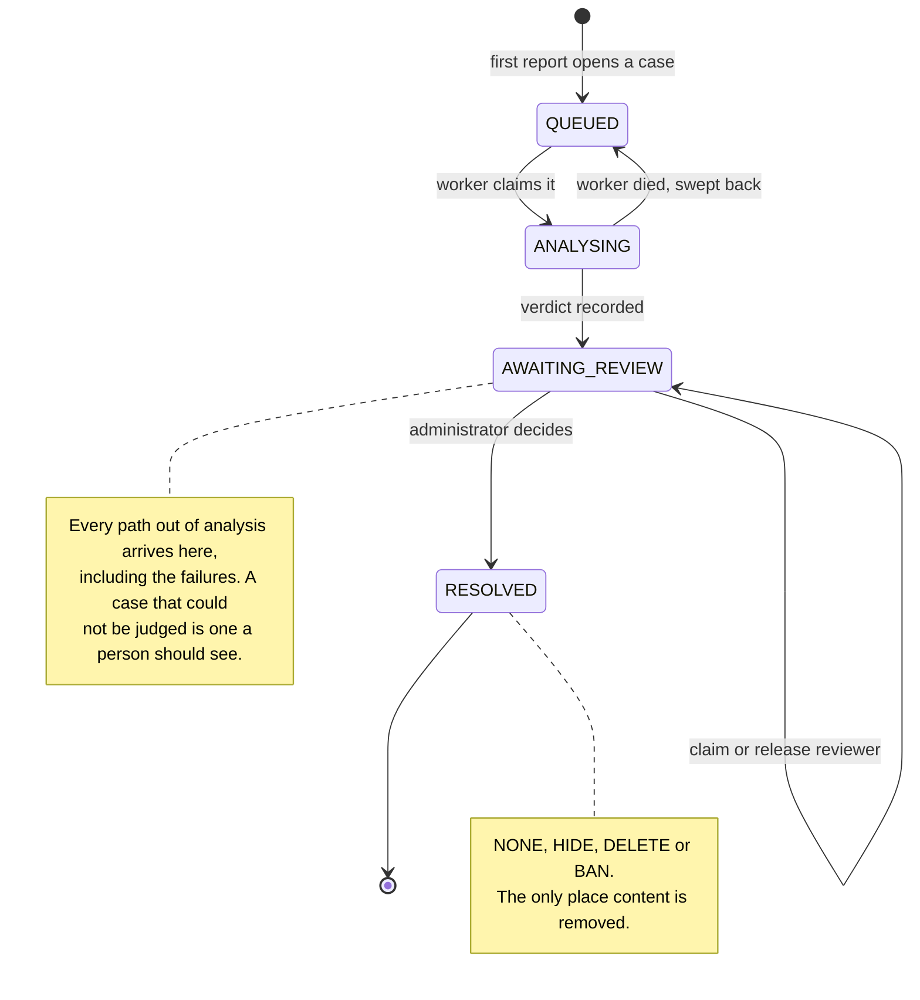
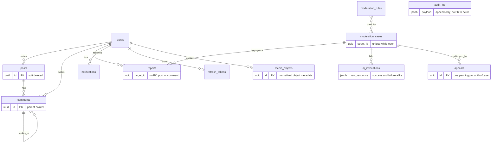

# Architecture

## The system



The dotted edges are the ones worth reading. A model engine exists only when one
is configured, and when it fails the queue falls back to `keyword-v1` rather than
stopping. Nothing else in the diagram changes shape when the model is absent.

There is one model box per model-and-prompt pair, named `model/version` — two
prompt revisions of one model are two engines, so the harness scores them against
each other instead of the newer one quietly replacing the older one's numbers.

## What happens to a report

```mermaid
sequenceDiagram
    participant M as Member
    participant API as REST API
    participant DB as PostgreSQL
    participant W as Worker
    participant E as Engine
    participant A as Administrator

    M->>API: POST /api/reports
    API->>DB: open or join the case for this target
    Note over DB: partial unique index on open cases:<br/>concurrent reports collapse into one
    API-->>M: 201, status AGGREGATED

    W->>DB: SELECT ... FOR UPDATE SKIP LOCKED
    W->>DB: mark ANALYSING, commit
    Note over W,DB: claim commits before analysis, so row<br/>locks are not held across a model call
    W->>E: evaluate
    alt engine answers
        E-->>W: decision, confidence, rationale, rule codes
    else engine fails
        E-->>W: timeout, invalid response, or throttling
        W->>E: fall back to the rule engine
    end
    W->>DB: record verdict, move to AWAITING_REVIEW

    Note over A: reviewer claims the case;<br/>the content is still visible here
    A->>API: POST /claim, then POST /decision {HIDE}
    API->>DB: hide content, resolve case, resolve its reports
    API->>DB: audit entry for every step
```

## Case lifecycle



Assignment is metadata rather than another case state. A claim records the
reviewer and prevents a conflicting decision while the case remains
`AWAITING_REVIEW`; it can be released without inventing another lifecycle state.
The review deadline is also stored on the case so SLA alerts do not depend on a
dashboard calculating time from memory.

## Schema



Three deliberate absences:

`reports.target_id` and `moderation_cases.target_id` carry no foreign key,
because each points at a post *or* a comment and one key cannot express that. The
alternative — two nullable columns behind a check constraint — keeps referential
integrity but makes every read path branch on which column is populated.

`audit_log.actor_id` carries no foreign key so that an entry outlives the account
it describes. A log that loses its subject when a user is deleted is not evidence.

`moderation_cases` has no global total-count column and the feed has no count query. A
number that costs a full scan and is stale on arrival is not worth the scan.

## Where the seams are

| Seam | Why it exists |
|---|---|
| `ModerationEngine` | Rules and models satisfy the same interface, so the fallback is possible at all and the evaluation harness can score both with one body of code. |
| `ChatCompletionPort` | All vendor knowledge in one class. The timeout, circuit breaker and backoff sit around it and are therefore testable against a stub that hangs, throws or lies. |
| `RuleProvider` | One query today. If the rule set ever outgrows a prompt, retrieval becomes a new implementation rather than surgery on every caller. |
| Services take an actor id | Authentication stays in the web layer, so the JWT work touched controllers only and services stay unit-testable. |
