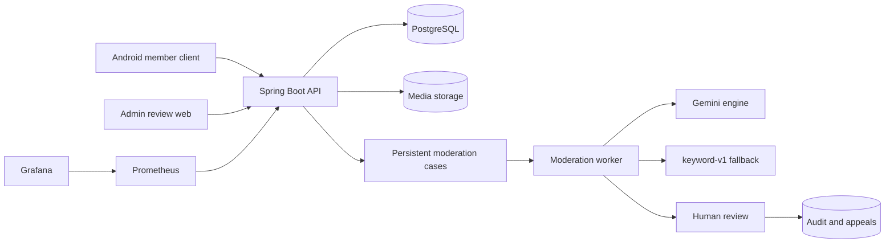

[](backend-project-report.md)
[](backend-project-report.zh-CN.md)

# De-Moderation Backend Project Report

> Updated: 13 September 2026
> Repository: `De-moderation-backend`
> Branch: `main`
> Scope: backend, database, AI moderation, admin web, testing, deployment and operations

## 1. Project Overview

De-Moderation is the backend and content moderation system for the `De-discussion` campus forum. Members use the Android client to register, publish posts and comments, upload images, report content and submit appeals. Administrators use a separate web console to review cases, revise decisions and resolve appeals.

The central principle is simple: **AI performs the initial classification; a person makes the final decision.**

This design addresses three practical requirements:

1. Moderation work must survive process restarts, concurrent requests and external-model failures.
2. The service must keep operating through its rule engine and human review when Gemini is unavailable.
3. Every recommendation, decision, correction and appeal must be traceable, reversible and explainable.

A reviewer can also ask an optional, read-only assistant to gather the author's record and the precedent for a case before deciding (§6.3). It recommends and never decides, is off by default, and has not yet been deployed to the public demo.

The complete demonstration path is working. The Cloudflare Pages admin console calls the Render backend, the backend stores data in Neon PostgreSQL and uses Gemini when available. Accounts, posts, comments, reports, moderation cases, appeals, notifications and administrator actions are persisted in the database; they are not mock frontend data.

Public endpoints:

- Admin console: `https://de-moderation-review-demo.pages.dev`
- Backup admin console: `https://de-moderation-review-demo.x2337445.chatgpt.site`
- Backend API: `https://de-moderation-api-demo.onrender.com`
- Readiness check: `https://de-moderation-api-demo.onrender.com/actuator/health/readiness`

This environment is suitable for interviews and API integration, but it is not yet a permanently operated production environment. The repository now contains what was missing — an S3-compatible media backend, Alertmanager delivery, an optional off-site backup copy, a restore drill and a mixed-workload load test — but the demo runs none of it yet. It still needs a bucket, SMTP credentials and an alert inbox, along with an always-on instance and cluster-specific Kubernetes values.

Three of those were exercised on 13 September 2026, which is a weaker claim than "deployed" and a stronger one than "written":

- **Restore drill: run, passed.** `scripts/restore-drill.sh` restored a real dump into a throwaway container — checksum, Flyway V9, seven core tables, 59 constraints and the case/report referential check all passed. The dump was a development database, not production, so what this establishes is that the drill works and that a dump of this schema restores cleanly.
- **`MEDIA_BACKEND=S3`: rehearsed end to end, not deployed.** The built jar was started against a local MinIO with the deployment's own environment variable names. An image uploaded through `POST /api/media` landed in the bucket under the configured prefix, and after a restart of the process the same request returned byte-identical content. The same jar on `FILESYSTEM` over a directory that was then deleted — a container rebuild — returned 404 for an image whose database row was still present, which is the failure this seam exists to end. What is still missing is only a real bucket and its credentials.
- **Alert delivery: rendering verified, delivery not.** `scripts/render-alertmanager.sh` refuses cleanly when the six variables are unset, and with values supplied it renders a config that Alertmanager's own `amtool` accepts, at mode 600. No alert has been delivered to anyone, because there is no SMTP account. Rehearsing this found and fixed a real defect: values were escaped for `sed` but not for the YAML string they land in, so an SMTP password containing a backslash or a quote was rejected with a YAML error that named neither.


## 2. System Architecture

| Component | Technology | Responsibility |
|---|---|---|
| Backend | Java 21, Spring Boot 3.5.16 | REST API, authentication, forum and moderation workflows |
| Database | PostgreSQL, Flyway, JPA/Hibernate | Business data, persistent queue, audit records and AI invocation records |
| AI moderation | Gemini, Spring AI, Resilience4j | Semantic recommendations, retry, circuit breaking and fallback |
| Rule engine | `keyword-v1` | Deterministic baseline and dependency-free fallback |
| Admin web | React 19, Next 16 API, vinext | Human review, corrected decisions and appeal handling |
| Client | Android, separate `De-discussion` repository | Member-facing forum interactions |
| Monitoring | Actuator, Micrometer, Prometheus, Grafana | Health, system metrics and moderation metrics |
| Deployment | Docker, Caddy, Render, Cloudflare Pages | Packaging, HTTPS and the public demonstration |



The backend stores business data and the moderation queue in the same PostgreSQL database. Workers claim records from the database rather than relying on an in-memory queue, so cases remain available after a restart. Automated analysis only produces a recommendation; hiding or deleting content, or banning an account, requires administrator confirmation.

## 3. Core Forum Functions

### 3.1 Authentication

Public registration can only create a `MEMBER`; a client cannot obtain administrator rights through a request field. A successful login returns a JWT access token valid for one hour and a refresh token valid for 30 days. Refresh tokens rotate after every use, and only their SHA-256 digests are stored, so an old token cannot be replayed.

The system supports password changes, sign-out from all devices and one-time password resets. Changing a password or signing out everywhere increments `tokenVersion`, immediately invalidating existing access tokens. Passwords are stored with BCrypt. Startup configuration creates an administrator only when the username does not exist; it never promotes an existing member with the same name.

### 3.2 Forum

Posts support creation, public reading, cursor pagination, author edits and soft deletion. Comments support top-level messages, nested replies, edits and soft deletion, with a maximum nesting depth of ten. Members cannot read deleted content, while administrators can still inspect the original content when reviewing a historical case.

The feed uses a `(created_at, id)` keyset cursor rather than an offset. Adding a new post to the top does not shift existing page boundaries, preventing duplicates and omissions during pagination.

### 3.3 Users and Notifications

Members can view and update their own display name and biography, and read other members' public profiles. Profile updates use actual PATCH semantics: an omitted field keeps its previous value, while an explicitly empty value clears it.

In-app notifications cover moderation outcomes, appeal status and pending administrator work. The API supports listing notifications, reading the unread count and marking notifications as read. The client currently polls for updates; WebSocket delivery and device push notifications are not implemented.

### 3.4 Media

The media endpoint accepts JPEG and PNG only, with default limits of 8 MiB and 20 million pixels. The service identifies the actual format, reads dimensions, fully decodes the image and re-encodes it. This blocks disguised files and decompression bombs while removing original metadata.

An uploader can attach an image only to their own post or comment. Public downloads are limited to images referenced by content that is still visible; an unpublished image or an image attached to hidden content cannot be fetched simply by guessing its UUID. Where the bytes live is a deployment setting behind one storage interface: a directory, or any S3-compatible bucket — AWS S3, Cloudflare R2, or GCS in interoperability mode. The public demo still writes to Render's local directory, which does not survive a rebuild, so it needs `MEDIA_BACKEND=S3`. An optional hourly sweep deletes media that no post or comment refers to once it is a day old, and never touches media attached to hidden or removed content, because those decisions can be reversed.

## 4. Moderation Workflow

A report moves through six steps:

1. A member reports a post or comment. The service validates the target, permissions, duplicate reports and rate limits.
2. Reports for the same target are aggregated into one open moderation case.
3. A worker claims a `QUEUED` case from PostgreSQL and moves it to `ANALYSING`.
4. Gemini recommends `ALLOW`, `REMOVE` or `ESCALATE`; if the model fails, the service uses `keyword-v1`.
5. The case enters human review, where an administrator chooses `NONE`, `HIDE`, `DELETE` or `BAN`.
6. The decision is appended to the audit history. It can later be revised or appealed by the affected author.

The state machine is deliberately small:

```text
QUEUED -> ANALYSING -> AWAITING_REVIEW -> RESOLVED
```

- `QUEUED`: the case has been persisted and is waiting for a worker.
- `ANALYSING`: a worker has claimed the case and is generating a recommendation.
- `AWAITING_REVIEW`: automated analysis has finished and an administrator must decide.
- `RESOLVED`: an administrator has made the final decision.

Administrator assignment is stored separately on the case rather than represented as another state. This keeps workflow progress separate from staff ownership.

## 5. Key Backend Design Decisions

### 5.1 Concurrent report aggregation

Several users may report the same content at the same time. A simple “query, then insert” sequence is unsafe: two transactions may both find no case and then create duplicates.

A PostgreSQL partial unique index ensures that only one unresolved case can exist for a target. `ON CONFLICT DO NOTHING` handles races during creation, while a single atomic SQL update increments `report_count` without lost updates. The database constraint is the final guarantee; application-level retry attaches the report to the winning case.

### 5.2 Worker concurrency

Workers use `SELECT ... FOR UPDATE SKIP LOCKED` to claim cases in parallel. A row locked by one worker is skipped by the others, preventing duplicate processing without serialising all workers behind one lock.

The claim transaction selects a case, sets it to `ANALYSING` and commits immediately. The model call runs outside that transaction, so external API latency does not hold a database lock or connection.

### 5.3 Failure recovery

A worker can crash after setting a case to `ANALYSING`. A scheduled recovery task finds cases that have exceeded the configured threshold and returns them to the queue. One process failure therefore cannot leave a case stuck permanently.

Model timeouts, rate limits and invalid responses do not corrupt case state. The service retries or degrades first; if automated analysis still cannot finish, the case continues to human review rather than remaining half-complete.

### 5.4 Database consistency

Flyway owns the schema, while Hibernate runs with `validate` only. Partial unique indexes, foreign keys, checks, JSONB columns and atomic updates enforce critical invariants. Soft deletion preserves references from reports, cases and audit records. The append-only audit log stores each recommendation and decision instead of overwriting history.

`open-in-view` is disabled, so services must load the data they need explicitly. Case and content listings use prefetching and have SQL-count tests to prevent N+1 query regressions.

## 6. AI Moderation Design

### 6.1 Two engines

| Engine | Strength | Role |
|---|---|---|
| `keyword-v1` | Deterministic, fast, no external dependency | Baseline, fallback and continued operation during outages |
| Gemini | Understands semantics, multiple languages and context | More accurate moderation recommendations |

Both implement the same `ModerationEngine` interface. Workers and evaluation code depend only on that interface, so the model, prompt version or rule engine can change without rewriting the workflow.

The Gemini engine is registered by model and prompt version, for example `gemini-3.5-flash-lite/v2`. Both affect results, so storing the full identifier connects production calls to evaluation results and cost records.

### 6.2 Reliability

| Protection | Behaviour |
|---|---|
| Timeout | A model call is limited to 30 seconds |
| Circuit breaker | Requests pause when the recent provider failure rate is too high |
| Rate-limit retry | HTTP 429 is retried up to four times with exponential backoff and jitter |
| Error classification | Unrecoverable errors, such as an invalid key, are not retried blindly |
| Output validation | JSON, decision, confidence, rationale and rule codes are validated |
| Correction retry | The model receives the exact validation error and gets one correction attempt |
| Fallback | A final Gemini failure switches to `keyword-v1` |
| Human escalation | If automated handling is still insufficient, the case proceeds to a person |

Every production invocation records the model, prompt version, content hash, status, attempt count, token use, latency, raw response and error reason. These records support cost and reliability analysis and make it possible to reconstruct the automated recommendation during a dispute.

For cases containing an image, Gemini receives the normalised image together with the text. The keyword engine ignores the image but still handles the text, so a multimodal-provider outage does not block the queue.

### 6.3 Case investigation

The pipeline decides one piece of content at a time. It cannot tell a reviewer whether this is the author's first offence or their fourth, or how a rule has been enforced before, because cases are keyed by content rather than by person. An optional assistant, off by default, answers those two questions.

When a reviewer asks, the service first fetches the author's decisions from the last 90 days and the precedent under the case's rules, then allows the model at most five rounds of read-only lookups before it must write a brief: a recommendation, an evidence band in place of a confidence number, the strongest argument against the recommendation, and the cases it relied on. Every citation must be a case a lookup actually returned; otherwise the brief is sent back once and then reported as inconclusive. A timeout or an open circuit produces a brief labelled partial rather than an error.

| Guarantee | How it is enforced |
|---|---|
| It cannot change anything | Every lookup runs in a read-only transaction; `AdminModerationService.decide` remains the only path that hides content or bans an account |
| It cannot be pointed at another case | The loop passes the case under investigation to each tool; the model's arguments never name it |
| It cannot run up a bill | At most 60 investigations per reviewer per hour; a stored brief is returned free, and a refused request is not charged |
| It can be audited | The brief is written to the audit log against the administrator who asked, and each model call is recorded in `ai_invocations` as `investigator/<prompt version>` |

Measured on 16 scenarios, each run three times against `gemini-3.5-flash-lite` with prompt `inv-v4`: a moderator could defend the recommendation in 0.875 of them, the answer was identical across runs in 0.938, and the brief cited what the case turns on in 0.813 — at about 2,100 prompt tokens and one lookup per investigation, roughly 3.6 times the tokens of a verdict. Two failures reproduce and are documented rather than patched: it will not be the first to recommend a ban, and it anchors on precedent even when the dismissal rate argues the other way. The design, prompt history and measurements are in [investigation.md](investigation.md).

## 7. Evaluation

The evaluation set contains 192 labelled English and Chinese samples: 122 English and 70 Chinese. Labels are `ALLOW`, `REMOVE` and `ESCALATE`. The set covers ordinary discussion, abuse, spam, illegal content and borderline examples that need context.

| Engine | Macro-F1 | ALLOW Recall | REMOVE Recall | ESCALATE Recall |
|---|---:|---:|---:|---:|
| `keyword-v1` | 0.286 | 1.000 | 0.106 | 0.000 |
| Gemini v1 | 0.617 | 0.978 | 0.939 | 0.056 |
| Gemini v2 | 0.924 | 0.989 | 0.970 | 0.778 |

The important result did not come from replacing the model. With the same model and Java implementation, changing the task definition raised Macro-F1 from **0.617 to 0.924** and `ESCALATE` recall from **0.056 to 0.778**.

The v1 prompt was close to asking:

> Does this content violate a rule?

The v2 prompt instead asks:

> Can this case be closed safely without human review?

The first question tends to mark requests for help, quoted abuse and context-poor content as safe. The second correctly escalates content that is uncertain but deserves attention. The gain came from defining the operational decision more accurately, not from making the prompt longer.

On 25 August 2026, a repeat run with the current key and model alias achieved 0.919 Macro-F1 across the 184 samples that completed on the first attempt. Eight samples exceeded the 30-second budget and all succeeded when rerun individually. Classification had not drifted materially, but the provider still showed tail latency, so timeout, fallback and human review remain necessary.

These numbers are not production accuracy. The dataset is small and is not a representative sample of complete production traffic; v2 was written after inspecting v1's mistakes on the same data; repeated model calls can also vary slightly.

### Held-out set

A second set was written on 12 September 2026, after the prompts were frozen, and was never read while writing one: 72 samples arranged as 36 minimal pairs, each a post written twice with one deliberate difference and a different correct answer. A pair counts as right only if both halves are, which is the question per-sample accuracy cannot ask. Every engine ran three times; ± is half the observed range.

| Engine | Macro-F1 | ESCALATE Recall | Pair accuracy | Changed answer |
|---|---:|---:|---:|---:|
| `keyword-v1` | 0.217 ±0.000 | 0.000 | 0.000 | 0 / 72 |
| Gemini v1 | 0.597 ±0.016 | 0.067 | 0.457 | 2 / 72 |
| Gemini v2 | 0.984 ±0.003 | 1.000 | 0.972 | 0 / 72 |

v1's ESCALATE failure reproduced on data written five weeks later (0.056 → 0.067), so the problem the rewrite fixed was real rather than an artefact of the first set. v2's 0.984 is still not an estimate of live accuracy: the held-out labels follow the same policy v2's prompt states, which makes its ESCALATE recall close to definitional. A third prompt version, v3, was measured against the same 72 samples on 13 September and classifies identically to v2 — same macro-F1 0.986, same pair accuracy 0.972, nothing fixed and nothing broken across all 72 — while writing its rationale in the language of the content: 28 of 28 Chinese samples explained in Chinese, against 3 of 28 for v2, for 11.6% more prompt tokens. That run also re-measured v2 a day after its first, at 0.986 against 0.984, a gap inside the first day's own range. The 192-sample table above remains a single run. Neither set supplies what an estimate needs — real administrator decisions — and the decision-corpus export described in [investigation.md](investigation.md) is the start of collecting them.

## 8. Security

| Area | Design |
|---|---|
| Authentication | BCrypt, HS256 JWT, refresh-token rotation, one-time reset tokens and `tokenVersion` |
| Authorisation | `MEMBER`/`ADMIN`, ownership checks and full protection of administrator routes |
| Account state | Every authenticated request reloads current role, ban status and token version |
| API policy | Deny by default; explicitly allow only public reads, authentication and health summary |
| CORS | Allow only admin origins configured through the environment; do not use cross-origin cookies |
| Media | Format and pixel checks, re-encoding, uploader ownership and public-visibility checks |
| Rate limiting | Limits for login, registration, refresh, reset, posts, comments and reports |
| Error handling | Consistent RFC 7807 responses; login failure does not reveal whether an account exists |

The JWT key has no default and must be at least 32 bytes; the application refuses to start when it is missing. Authentication reloads the user on every request, so a ban, administrator demotion or “sign out all devices” takes effect without waiting for the JWT to expire.

The production profile disables Swagger. Prometheus should only be available on an internal observability network. A summary health endpoint is public, while component details require administrator access. The admin console keeps tokens in `sessionStorage`, so they disappear when the browser session closes.

## 9. Admin Review and Appeals

The admin console has pending, resolved and appeal views. An administrator can inspect the original text, image, report count, AI recommendation, confidence, rule identifiers, SLA and complete audit history, then claim or release the case.

With the investigation assistant enabled, a case also shows its brief: the recommendation, the evidence band, the argument against, and each cited case as a link that opens it, with a way back to the case being decided. Opening a case never starts an investigation; a reviewer has to ask, and asking again after new reports is an explicit, charged choice.

Final actions are:

- `NONE`: close the review without changing content.
- `HIDE`: soft-delete the content.
- `DELETE`: apply delete semantics while retaining the audit trail.
- `BAN`: hide the content and ban its author.

The database locks the case while a decision is made. If another administrator already owns it, a second administrator cannot decide it directly. A resolved case can be decided again: the service reverses the previous effect before applying the new one, without deleting the old audit entry. If several cases independently keep the same account banned, reversing one case does not incorrectly remove the other bans.

An affected author may appeal `HIDE`, `DELETE` or `BAN`. When an administrator accepts an appeal, the same correction logic restores the content or account and sends in-app notifications to the relevant users.

## 10. Testing

Integration tests use Testcontainers with real PostgreSQL 16 rather than H2. The implementation depends on PostgreSQL partial unique indexes, JSONB, `ON CONFLICT` and `SKIP LOCKED`; H2 cannot verify these behaviours reliably.

| Test area | Main coverage |
|---|---|
| Authentication and security | Login, JWT, refresh rotation, replay, bans, permissions and consistent errors |
| Forum APIs | Posts, comments, pagination, ownership, soft deletion, depth and rate limits |
| Moderation workflow | Report aggregation, worker claiming, decisions, corrections and stale-case recovery |
| Concurrency | Partial unique indexes, atomic counters, case assignment and multiple workers |
| AI failure handling | Timeout, HTTP 429, circuit breaking, invalid output, correction retry and fallback |
| Appeals and notifications | Appeal permissions, reversal, state restoration and notifications |
| Media | Format, pixel count, re-encoding, ownership and access control |
| Media storage | One shared contract both backends must satisfy, run against a directory and against a real S3 server |
| Media sweep | What the orphan sweep deletes, and — the assertions that matter — what it refuses to delete |
| Case investigation | Tool whitelist, read-only transactions, the step budget, citation checking, the shared circuit, endpoint access and limits, and the tool-calling adapter itself |
| Evaluation harness | Pair scoring, multi-run spread, instability, and the held-out set's own invariants |
| Database and API policy | Flyway V1–V9, Actuator, Swagger and N+1 query counts |

The S3 backend is tested against MinIO through Testcontainers rather than against
a stub. The three places it could be wrong while passing a hand-written double
are all protocol behaviours: a delete of a missing key succeeds, a head of one
raises `NoSuchKey`, and listing is lexicographic. A double would simply agree
with whatever the implementation did.

The held-out dataset is itself under test. It is the one artefact nothing else
touches — hand-edited, the denominator of every published number, and silently
wrong if a pair's halves carry the same label or a sample was copied out of the
set the prompts were tuned on. `HeldOutDatasetTest` asserts those properties
rather than trusting them.

Verified locally on 13 September 2026:

- Maven tests: 358 run, 0 failures, 0 errors, 2 skipped (the two suites that require a live model key)
- PostgreSQL: 16 through Testcontainers
- MinIO: `RELEASE.2024-08-29` through Testcontainers
- Flyway: V1–V9 validated and applied
- Admin web: lint, type check and production build passed
- Backend: Docker image build passed
- Review console: a stored brief rendered against a local backend, and each citation opened the cited case and led back
- Restore drill: passed on a real dump, and failed as it should on a corrupted copy
- Load: `k6-mixed.js` held every budget against a local build (§11)
- GitHub Actions: last passed on `main` on 25 August 2026; this revision runs when it is pushed

## 11. Deployment and Operations

The current public demonstration uses:

```text
Cloudflare Pages
        |
        v
Render Spring Boot API
        |
        v
Neon PostgreSQL
        |
        +--> Gemini, with keyword-v1 fallback
```

| Layer | Current status |
|---|---|
| Admin web | Publicly available over HTTPS on Cloudflare Pages |
| Backend | Render Docker service; readiness reports `UP` |
| Database | Managed Neon PostgreSQL with V1–V8 applied; V9 arrives with the next deployment |
| AI | Gemini v2 active, with `keyword-v1` fallback |
| Secrets | Local `.env` is ignored by Git; cloud values use platform environment variables |
| CI | Backend verify and Docker build; admin lint and build |

The repository also contains a single-host production Compose stack, Caddy HTTPS, Prometheus, Alertmanager, a Grafana datasource, alert rules, database and media backup/restore scripts, a restore drill, and Kubernetes templates.

Three gaps in that list have since been closed, and it is worth being precise about what "closed" means for each.

**Alert delivery.** The rules had been evaluated by Prometheus and delivered to nobody: there was no `alerting` block and no Alertmanager. Both now exist, with severity routing, an inhibition rule so one outage sends one email rather than three, and a render step — Alertmanager is the one component here that does not expand environment variables in its own config, so `scripts/render-alertmanager.sh` fills the template in, refuses to write anything when a variable is unset, and checks the result with `amtool`. What has been verified is that the rendered config is accepted by Alertmanager's own tool. What has not been verified is that a real SMTP account delivers to a real inbox, because no such account has been supplied.

**Off-site backup.** `scripts/backup.sh` takes an optional `OFFSITE_BUCKET` and copies each dump, media archive and checksum to an S3-compatible bucket, then reads the dump back to prove it arrived — an upload that reports success and stores nothing is the failure that makes people believe they have backups. Unverified against a real bucket, for the same reason.

**Restore.** This one is verified. `scripts/restore-drill.sh` restores a dump into a throwaway PostgreSQL container and checks the checksum, the Flyway history, the core tables, the constraint count and one referential invariant. It has been run against a real dump of this project's database and passed, and run against a deliberately corrupted copy of that dump and failed with a non-zero exit — a check that can only pass is not a check. Re-run on 13 September 2026 with the same result: every check passed on the real dump, and the corrupted copy produced 14 failures and exit code 1.

**Load.** `load/k6-mixed.js` runs six workloads at once — browsing, sign-in, writing, reporting, uploading and the admin case list — each with its own latency budget. Run on 13 September 2026 against a local build on a laptop, with the keyword engine, a throwaway database and the per-account limits raised: 6,368 requests over three minutes, no failed request, `campusguard_throttled` zero, and every budget held — p95 9 ms browsing, 22 ms writing, 68 ms for the case list, 84 ms reporting and 140 ms uploading, against budgets of 500, 800, 1200, 1000 and 2500.

The run before it did not hold, and the reason is worth recording. Raising the three limits the script and the runbook named left `campusguard.auth-rate-limit.logins-per-account` at its default of 12 per fifteen minutes; a virtual user here is one account signing in for the whole run, so 24 of every 36 attempts came back 429, the sign-in failure rate was 64.9% and every latency budget was still green, because a 429 is fast. Both lists now name all five. `campusguard_throttled` is the number that separates those two runs, and it is why it is printed.

That shows the script works and these paths hold under a mix. It does not show capacity: the database, the application and the load generator shared one machine, and no model was called.

Real cluster parameters are still not supplied.

Opening the API root returns 401 by design because the policy denies unspecified endpoints. The admin console is the browser-facing application; readiness is the service check. Render's free instance may sleep when idle, so the health endpoint should be opened before a demonstration.

## 12. Limitations and Future Work

| Category | Current limitation | Next step |
|---|---|---|
| Evaluation | Neither dataset is real traffic. The held-out set removes the tuning leak but its labels were written from the same policy the prompt states, so it cannot be read as an estimate of live accuracy | Harvest decided cases into a corpus and score against what reviewers actually did |
| Investigation | Will not be the first to escalate, and anchors on precedent even when the dismissal rate argues against it | Retrieval over decided cases, once there are enough of them |
| Production infrastructure | Free instances sleep, domains are platform-owned and Kubernetes remains a template | Use an always-on instance, owned domain, Secret Manager and cluster-specific values |
| Alerting and off-site backup | Configured and checked with the vendors' own tools, but never exercised against a real SMTP account or a real bucket | Supply credentials and confirm one alert and one off-site copy end to end |
| Comment fan-out | Top-level comments are paginated; one root comment can still have a wide reply tree | Page replies within a thread |
| Media atomicity | Bytes and row are written in two steps and cannot share a transaction | Already bounded: compensation covers the ordinary failure, the sweep covers a process that dies between them |
| Investigation measurement | 16 scenarios rather than the 30–50 planned, and consensus mode (`INVESTIGATOR_RUNS=3`) unmeasured because its run exhausted the quota | Grow the scenario set, then measure consensus when quota allows |
| Evaluation variance | The 192-sample table is still a single run; the held-out set now has three runs of keyword-v1, v1, v2 and v3, but v1 and v3 were measured in different sessions | Re-run the 192-sample set three times; a single session covering all four engines needs more than one day of free-tier quota |
| Demo configuration | The public demo still runs the August build: filesystem media, no alert receiver and no investigation assistant | Deploy this revision with `MEDIA_BACKEND=S3`, a rendered Alertmanager config and, if wanted, `INVESTIGATOR_ENABLED=true` |

Closed since the previous revision: media durability (an S3-compatible backend
behind a storage seam, with an orphan sweep), alert delivery (Alertmanager with
severity routing), off-site backup (an optional verified copy), restore
confidence (a drill that has been run and that fails on a corrupt dump), load
coverage (a six-workload k6 script with a budget per workload, run locally but
not yet against staging) and the
deprecated GitHub Actions versions.

---

## Appendix A — API Endpoints

| Module | Main endpoints | Access |
|---|---|---|
| Authentication | register, login, refresh, change password, logout-all, reset request/confirm | Login, registration and reset are public; the rest require authentication |
| Users | `/api/users/me`, `/api/users/{id}` | Authenticated users; only the owner can update their profile |
| Posts | create, feed, detail, update, delete | Reads are public; writes require authentication and ownership checks |
| Comments | create, thread, update, delete | Reads are public; writes require authentication and ownership checks |
| Media | upload, read | Upload requires authentication; only media referenced by visible content is public |
| Reports | create, detail | Authenticated; detail is limited to the reporter or an administrator |
| Notifications | list, unread count, mark read | A user can access only their own notifications |
| Appeals | create, mine | Affected authors |
| Admin appeals | list, decision | Administrators only |
| Moderation cases | list, detail, decision, assignment | Administrators only |
| Case investigation | `GET /api/admin/moderation-cases/{id}/investigation`, `POST /api/admin/moderation-cases/{id}/investigate` | Administrators only; the POST is limited per reviewer, answers 409 unless the case is awaiting review, and 503 while the assistant is off |
| Moderation status | `/api/moderation/status` | Public; returns capability status only |
| Operations | health, metrics, Prometheus | Summary health is public; details are limited to administrators or the internal network |

Local development exposes `/swagger-ui.html` and `/v3/api-docs`; the production profile disables both.

## Appendix B — Database Migrations

| Version | Main content | Purpose |
|---|---|---|
| V1 | users, posts, comments | Accounts, forum content and soft-deletion foundations |
| V2 | reports | Post/comment reporting and duplicate-report constraints |
| V3 | rules, moderation cases, audit log | Moderation state machine, concurrent aggregation and audit history |
| V4 | report lifecycle | Simplify report status and close reports with their case |
| V5 | `ai_invocations` | Store model success, failure, cost and latency |
| V6 | `RATE_LIMITED` | Separate provider throttling from ordinary failure |
| V7 | `comment.depth` | Limit nesting to prevent recursive stack overflow |
| V8 | production capabilities | Profiles, sessions, reset, throttling, media, assignment, SLA, appeals and notifications |
| V9 | investigation indexes | Partial indexes behind "this author's past decisions" and "precedent under this rule" |

`reports.target_id` and `moderation_cases.target_id` may refer to either a post or a comment, so they cannot both use a conventional database foreign key. The service validates the target on write. `audit_log.actor_id` deliberately has no user foreign key, preserving the audit history after account deletion. Raw AI responses and audit payloads use JSONB to accommodate different action structures.

## Appendix C — Production Configuration

### C.1 Runtime configuration

Real secrets belong in a local `.env`, Render environment variables or a future Secret Manager, never in code or Git. The main values are the database URL and credentials, JWT secret, administrator bootstrap password, Grafana password, CORS origins and Gemini key, plus, where used, the media bucket, alert SMTP and off-site backup credentials. Password-reset mail (`MAIL_*`) and alert mail (`ALERT_*`) are configured separately, and neither is configured on the demo.

The administrator is a real database record. Its username is `admin`, while its password comes from `ADMIN_PASSWORD`; neither the report nor the repository contains the real password. Initialisation runs only when the account does not exist, and changing the environment value does not replace an existing database password.

### C.2 Local development

The backend can be opened in IntelliJ IDEA by opening the repository root or importing `pom.xml`, using JDK 21. The admin web is under `admin-web` and can be edited in IntelliJ, WebStorm or VS Code.

```bash
docker compose up -d
set -a && . ./.env && set +a
mvn spring-boot:run
```

```bash
cd admin-web
npm ci
npm run dev
```

The local addresses are `http://localhost:8080` and `http://localhost:3000`. `localhost` works only on the current computer and is not a public interview URL.

### C.3 Deployment assets

- `Dockerfile`: non-root Java 21 backend image.
- `admin-web/Dockerfile`: vinext standalone admin image.
- `docker-compose.prod.yml`: PostgreSQL, backend, admin web, Caddy, Prometheus, Alertmanager and Grafana.
- `deploy/Caddyfile`: HTTPS reverse proxy for the main and API domains.
- `deploy/observability`: Prometheus, Grafana datasource, alert rules and the Alertmanager template.
- `scripts/backup.sh` / `restore.sh`: database, media, checksums, an optional verified off-site copy and explicit restore confirmation.
- `scripts/restore-drill.sh`: restores the newest dump into a throwaway container and checks the result.
- `scripts/render-alertmanager.sh`: fills in the Alertmanager template and validates it with `amtool`.
- `load/k6-mixed.js`: six workloads with a latency budget each; `load/k6-smoke.js` remains for a quick read-only check.
- `deploy/k8s`: Deployment, Service, Ingress, TLS, HPA, PDB, NetworkPolicy and PVC templates.

The Kubernetes templates cannot be applied safely to an unknown cluster. Actual deployment requires an image registry, immutable tags, an Ingress Controller, cert-manager, Secret Manager, managed PostgreSQL, the monitoring namespace and an available storage class.

## Appendix D — Development Issues

| Issue | Impact | Resolution |
|---|---|---|
| JWT contained stale role and status | A ban or demotion did not take effect immediately | Reload the account and verify `tokenVersion` during every authentication |
| Concurrent reports for one target | Duplicate cases and lost counts | Partial unique index, `ON CONFLICT` and atomic increment |
| Multiple workers claiming cases | Duplicate processing or lock waits | `FOR UPDATE SKIP LOCKED` |
| Worker exits during analysis | Case remains in `ANALYSING` forever | Scheduled stale-case recovery |
| Gemini timeout or outage | Queue thread waits too long | 30-second timeout, circuit breaker and rule fallback |
| HTTP 429 treated as a normal error | Recoverable throttling fails immediately | `RATE_LIMITED`, exponential backoff and jitter |
| Invalid model JSON fields | Invalid confidence or rules reach the database | Strict validation and one correction retry |
| v1 rarely escalated borderline content | `ESCALATE` recall was only 0.056 | Redefine the task and rerun the same evaluation |
| Unlimited comment nesting | Deep chains cause stack overflow | Service and database depth limit of ten |
| Offset feed drift | Duplicated or missing posts during paging | `(created_at,id)` keyset cursor |
| Lazy loading in lists | N+1 queries | Join fetches, disabled open-in-view and query-count tests |
| Hidden content unavailable for review | Administrators cannot explain an old decision | Separate member reads from administrator review reads |
| PATCH clears omitted fields | Updating one field removes another | `null` means omitted; an empty value means explicitly clear |
| Image validation used only extension | Disguised files and metadata leakage | Format/pixel checks, decode and re-encode |
| Hikari durations written as `5s` | Production profile fails to start | Use integer milliseconds `5000/3000` |
| Docker preloaded all Maven dependencies | Slow builds and oversized cache | Package directly with a BuildKit cache |
| Admin image too large or missing dependencies | 1.71 GB image or non-running build | Standalone output with minimal runtime dependencies |
| Prometheus had no receiver | Rules fired but reached nobody | Alertmanager with severity routing, rendered from a template and checked with `amtool` |
| Render application and admin ports differed | Health checks could not connect | Use platform port 10000 consistently |
| Render free-instance cold start | A healthy deployment looked unavailable | Wait for readiness and wake it before a demonstration |
| API root returned 401 | Mistaken for a broken website | Distinguish the admin site, API and readiness; retain deny-by-default |
| Neon used PostgreSQL 18.6 | Flyway displayed a tested-version warning | Migrations succeeded; prefer 16/17 long term or upgrade Flyway |
| Cloudflare ZIP was not actually uploaded | The Pages project contained no site files | Upload `admin-web/out` and verify a public HTTP 200 response |
| Filesystem media on Render | Every rebuild dropped uploaded images while their rows remained | S3-compatible backend behind a storage interface, with an orphan sweep |
| Brief stored through self-invocation | The first real investigation returned 500, because the audit write ran outside a transaction | Store the brief through a separate bean, and test the path the controller actually calls |
| Gemini 3 function calls replayed without thought signatures | The provider rejected the second turn of an investigation with 400 | Narrate earlier turns as text; tool declarations still accompany every request |
| Investigation limit charged before the case check | A reviewer clicking on resolved cases spent the hourly allowance on 409s | Check the case first, so only a request that can reach a model is counted |
| Missing usage recorded as zero tokens | A response without usage would be averaged in as a free call | Treat Spring AI's `EmptyUsage` as unknown in both model adapters |
| Alertmanager config mounted with short syntax | A config nobody rendered became an empty directory and a restarting container | Long-syntax bind with `create_host_path: false`, so the deploy stops instead |

## Appendix E — Commit and Development History

Before the production work was merged, `main` contained 23 sequential feature commits. On 25 August 2026, the production completion, Render snapshot connection, pull-request merge and report revision brought the current history to 28 commits.

| Phase | Representative commits | Result |
|---|---|---|
| Bootstrap | `da33491` | Spring Boot, PostgreSQL and Flyway |
| Forum REST | `f2e8d28`, `91dece2` | Posts, comments, reports, JWT and ownership |
| Moderation core | `14e11ac`, `7481aa3` | Cases, queue, worker, audit and administrator decisions |
| AI and evaluation | `29bab20`–`21c7a80` | Gemini, fallback, 192 samples, evaluation and throttling |
| Prompt iteration | `1e71ceb`–`7a27cd2` | Multiple engines, prompt versions and v2 improvement |
| Reliability/security | `49d86f6`–`5a0e8cd` | Stale recovery, tighter permissions and comment bounds |
| Documentation | `eacc263`, `4e9a5c2` | English and Chinese README files and architecture notes |
| Admin correction | `eb52cfd` | Decision correction and initial administrator creation |
| Production completion | `ef31899` | Sessions, media, appeals, notifications, admin web and operations |
| Render snapshot link | `8a195f1`, `29e79a1` | Connect the unrelated deployment snapshot as a second parent |
| Main merge | `0a89a9e`, PR #1 | Merge the complete implementation into `main` with passing CI |
| Report revision | `Revise the report` | Concise READMEs and complete English and Chinese backend reports |

`render-demo` began as a single deployment snapshot with no common ancestor. A direct forced merge produced many `add/add` conflicts. The final approach committed the complete production implementation first, then connected the snapshot history with a content-preserving merge commit. This kept the README, evaluation data and branch history intact.

The September work was developed on `feat/investigation-agent`: first the case-investigation assistant — author and rule history queries, a read-only tool registry, the bounded loop, prompt versions `inv-v1` to `inv-v5`, the review-console panel, the decision-corpus export and the investigation scenario set — and then the held-out evaluation set with multi-run spread, the S3-compatible media backend and orphan sweep, Alertmanager delivery, the off-site backup copy, the restore drill and the mixed k6 workload.
