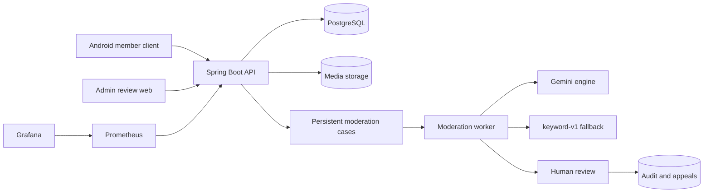

[](backend-project-report.md)
[](backend-project-report.zh-CN.md)

# De-Moderation 后端项目报告

> 更新时间：2026 年 8 月 25 日
> 仓库：`De-moderation`
> 分支：`main`
> 报告范围：后端、数据库、AI 审核、管理员网页、测试、部署和运维

## 1. Project Overview

De-Moderation 是校园论坛 `De-discussion` 的后端和内容审核系统。普通成员通过 Android 客户端注册、发帖、评论、上传图片、举报内容和提交申诉；管理员通过独立网页处理审核案件、修改裁决并回复申诉。

项目的核心原则是：**AI 负责初步分类，人负责最终决定。**

这样设计不是为了让模型自动删帖，而是为了同时解决三个问题：

1. 审核任务不能因为进程退出、并发竞争或外部模型故障而丢失。
2. Gemini 不可用时，系统仍能依靠规则引擎和人工审核继续工作。
3. 每次建议、裁决、改判和申诉都能追踪、撤销和解释。

目前项目已经具备完整的演示链路：Cloudflare Pages 管理网页调用 Render 后端，后端连接 Neon PostgreSQL，并在可用时调用 Gemini。账号、帖子、评论、举报、审核、申诉、通知和管理员操作都已经落到真实数据库中，不是前端假数据。

当前公开地址：

- 管理员网页：`https://de-moderation-review-demo.pages.dev`
- 备用网页：`https://de-moderation-review-demo.x2337445.chatgpt.site`
- 后端 API：`https://de-moderation-api-demo.onrender.com`
- 健康检查：`https://de-moderation-api-demo.onrender.com/actuator/health/readiness`

这套环境适合面试演示和接口联调，但还不是长期无人值守的正式生产环境。媒体对象存储、SMTP、外部备份、真实告警接收端、完整负载测试和 Kubernetes 集群参数仍需补齐。

## 2. System Architecture

| Component | Technology | Responsibility |
|---|---|---|
| Backend | Java 21、Spring Boot 3.5.16 | REST API、认证、论坛和审核流程 |
| Database | PostgreSQL、Flyway、JPA/Hibernate | 业务数据、持久化队列、审计和 AI 调用记录 |
| AI moderation | Gemini、Spring AI、Resilience4j | 语义审核建议、重试、断路和降级 |
| Rule engine | `keyword-v1` | 确定性基线和无外部依赖兜底 |
| Admin web | React 19、Next 16 API、vinext | 人工审核、改判和申诉处理 |
| Client | Android，独立仓库 `De-discussion` | 普通成员论坛交互 |
| Monitoring | Actuator、Micrometer、Prometheus、Grafana | 健康状态、系统指标和审核指标 |
| Deployment | Docker、Caddy、Render、Cloudflare Pages | 打包、HTTPS 和公开演示 |



后端使用同一个 PostgreSQL 保存业务数据和审核队列。worker 从数据库领取任务，不依赖单独的内存队列，因此服务重启后案件仍然存在。自动分析只产生建议，内容隐藏、删除或封禁必须由管理员确认。

## 3. Core Forum Functions

### 3.1 Authentication

公开注册只能创建 `MEMBER`，不能通过请求字段获取管理员权限。登录成功后返回一小时有效的 JWT access token 和 30 天 refresh token。refresh token 每次使用都会轮换，数据库只保存 SHA-256 摘要，旧 token 不能重放。

系统支持改密码、退出全部设备和一次性密码重置。改密码或退出全部设备会增加 `tokenVersion`，让已有 access token 立即失效。密码使用 BCrypt 保存；管理员由启动配置在账号不存在时创建，不会把已有同名成员自动提升为管理员。

### 3.2 Forum

帖子支持创建、公开读取、游标分页、作者编辑和软删除。评论支持顶层评论、嵌套回复、编辑和软删除，最大深度为 10。普通用户看不到已删除内容，管理员复核历史案件时仍能读取原内容。

feed 使用 `(created_at, id)` keyset cursor，而不是 offset。新帖子插入顶部时不会改变后续页边界，因此能避免重复和漏项。

### 3.3 User and Notifications

用户可以查看和修改自己的显示名和简介，也能读取其他成员的公开资料。资料更新使用真正的 PATCH 语义：未提交的字段保持原值，只有明确提交空值才清空内容。

站内通知覆盖审核结果、申诉状态和管理员待处理事项，支持列表、未读数量和标记已读。目前通知通过客户端轮询获取，没有 WebSocket 或系统推送。

### 3.4 Media

媒体接口只接受 JPEG 和 PNG，默认限制 8 MiB 和 2,000 万像素。服务会识别真实格式、读取尺寸、完整解码并重新编码，避免伪装文件、像素炸弹和原始元数据泄露。

只有上传者能把图片挂到自己的帖子或评论上。公开下载只允许读取仍被可见内容引用的图片，未发布图片和隐藏内容的图片不能通过猜 UUID 直接访问。当前文件写入 Render 本地目录，正式环境需要迁移到 R2、S3 或 GCS。

## 4. Moderation Workflow

一条举报会经过下面六步：

1. 用户举报帖子或评论，系统检查目标、权限、重复举报和频率限制。
2. 同一目标的多个举报聚合到一个未关闭的 moderation case。
3. worker 从 PostgreSQL 领取 `QUEUED` 案件并改为 `ANALYSING`。
4. Gemini 返回 `ALLOW`、`REMOVE` 或 `ESCALATE`；模型失败时使用 `keyword-v1`。
5. 案件进入人工复核，管理员选择 `NONE`、`HIDE`、`DELETE` 或 `BAN`。
6. 最终决定写入审计记录，之后仍可改判或由受影响作者申诉。

案件状态机保持简单：

```text
QUEUED -> ANALYSING -> AWAITING_REVIEW -> RESOLVED
```

- `QUEUED`：案件已经持久化，等待 worker。
- `ANALYSING`：worker 已领取，正在生成建议。
- `AWAITING_REVIEW`：自动建议完成，等待管理员。
- `RESOLVED`：管理员已经做出最终决定。

管理员认领是案件上的分配信息，不额外增加状态。这样案件进度和人员分工不会混在同一个状态机里。

## 5. Key Backend Design Decisions

### 5.1 Concurrent report aggregation

多个用户可能同时举报同一内容。如果只做“先查询、再插入”，两个请求都可能看到“没有案件”，随后各建一条记录。

项目用 PostgreSQL 部分唯一索引保证同一目标只能有一个未解决案件，并通过 `ON CONFLICT DO NOTHING` 处理竞争。`report_count` 使用单条 SQL 原子加一，避免并发请求相互覆盖。数据库约束是最后保证，应用层重试负责把举报加入已经存在的案件。

### 5.2 Worker concurrency

多个 worker 使用 `SELECT ... FOR UPDATE SKIP LOCKED` 并行领取案件。被一个 worker 锁定的记录会被其他 worker 跳过，因此不会重复处理，也不会让所有实例串行等待。

领取事务只负责选中案件并写入 `ANALYSING`，随后立即提交。模型调用在事务外完成，避免外部 API 的长延迟占用数据库锁和连接。

### 5.3 Failure recovery

worker 可能在写入 `ANALYSING` 后崩溃。系统定时查找超过阈值仍未完成的案件，把它们重新放回队列。这样一次进程退出不会让案件永久卡住。

模型超时、限流或返回错误不会破坏案件状态：系统先重试或降级，最终无法自动处理时将案件交给人工，而不是停留在半完成状态。

### 5.4 Database consistency

Flyway 完全负责数据库结构，Hibernate 只执行 `validate`。部分唯一索引、外键、CHECK、JSONB 和原子更新负责保证关键约束；软删除让举报、案件和审计记录仍能引用原内容；追加式 audit log 保存每次建议和决定，不覆盖历史。

`open-in-view` 被关闭，查询必须在服务层明确完成。案件列表和内容列表使用预取并配有 SQL 数量测试，防止 N+1 查询重新出现。

## 6. AI Moderation Design

### 6.1 Two engines

| Engine | Strength | Role |
|---|---|---|
| `keyword-v1` | 确定、快速、没有外部依赖 | 基线、兜底和故障期间继续运行 |
| Gemini | 能理解语义、多语言和上下文 | 生成更准确的审核建议 |

两个引擎实现同一个 `ModerationEngine` 接口。worker 和评测程序只依赖这个接口，因此可以在不改业务流程的情况下切换模型、提示词版本或规则引擎。

Gemini 引擎以“模型名/提示词版本”注册，例如 `gemini-3.5-flash-lite/v2`。模型和提示词都会影响结果，记录完整名称才能把生产调用、评测和成本对应起来。

### 6.2 Reliability

| Protection | Behaviour |
|---|---|
| Timeout | 单次模型调用最多 30 秒 |
| Circuit breaker | 最近调用失败率过高时暂时停止请求供应商 |
| Rate-limit retry | 对 429 最多重试 4 次，指数退避并加入随机抖动 |
| Error classification | 无效 Key 等不可恢复错误不会盲目重试 |
| Output validation | 验证 JSON、decision、confidence、rationale 和 rule codes |
| Correction retry | 输出错误时把具体原因反馈给模型，再纠正一次 |
| Fallback | Gemini 最终失败后使用 `keyword-v1` |
| Human escalation | 自动引擎都无法处理时仍进入人工审核 |

每次生产模型调用都会记录模型、提示词版本、内容哈希、状态、尝试次数、token、延迟、原始回答和错误原因。这样可以分析成本和稳定性，也能在争议发生时还原当时的自动建议。

带图片的案件会把规范化后的图片和文字一起交给 Gemini。关键词引擎忽略图片但仍能处理文字，因此多模态模型不可用时队列也不会堵塞。

## 7. Evaluation

评测集包含 192 条中英双语样本，其中英文 122 条、中文 70 条，标签为 `ALLOW`、`REMOVE` 和 `ESCALATE`。内容覆盖普通讨论、辱骂、垃圾广告、违法内容和需要上下文判断的边界案例。

| Engine | Macro-F1 | ALLOW Recall | REMOVE Recall | ESCALATE Recall |
|---|---:|---:|---:|---:|
| `keyword-v1` | 0.286 | 1.000 | 0.106 | 0.000 |
| Gemini v1 | 0.617 | 0.978 | 0.939 | 0.056 |
| Gemini v2 | 0.924 | 0.989 | 0.970 | 0.778 |

最重要的结果不是“换了更大的模型”，而是同一个模型只调整任务定义后，Macro-F1 从 **0.617 提升到 0.924**，`ESCALATE` recall 从 **0.056 提升到 0.778**。

v1 更接近在问：

> 这段内容是否违反规则？

v2 改成：

> 这个案件能否在不经过人工复核的情况下安全关闭？

前一个问题容易把求助、引用辱骂和缺少上下文的内容直接判为安全；后一个问题把“不确定但值得人看”的内容正确升级。提升来自任务定义改变，而不是简单把提示词写得更长。

2026 年 8 月 25 日使用当前 Key 和模型别名复测时，Gemini 在首轮成功返回的 184 条上 Macro-F1 为 0.919，8 条超过 30 秒预算；单独重跑这 8 条后全部成功。分类表现没有明显漂移，但供应商仍有长尾延迟，因此超时、降级和人工复核不能移除。

这些结果不能当成真实线上准确率：数据规模较小，不来自完整生产流量；v2 看过 v1 在同一数据上的错误；模型重复运行也会有轻微漂移。现有评测能证明 v2 明显优于规则基线和 v1，但上线后仍需要独立留出集和真实人工裁决反馈。

## 8. Security

| Area | Design |
|---|---|
| Authentication | BCrypt、HS256 JWT、refresh-token rotation、一次性 reset token、`tokenVersion` |
| Authorization | `MEMBER`/`ADMIN`、资源归属校验、管理员路由整体保护 |
| Account state | 每次认证重新读取当前角色、封禁状态和 token 版本 |
| API policy | 默认拒绝，只明确开放公开读取、登录和健康概要 |
| CORS | 只允许环境变量配置的管理网页来源，不使用跨域 cookie |
| Media | 格式和像素验证、重新编码、上传者归属和公开可见性校验 |
| Rate limiting | 登录、注册、刷新、重置、帖子、评论和举报均有上限 |
| Error handling | RFC 7807 统一错误；登录失败不区分账号不存在或密码错误 |

JWT 密钥没有默认值且至少 32 字节，没有配置时程序直接启动失败。每次认证都会重新读取用户，因此账号被封禁、管理员被降级或执行“退出所有设备”后，旧 JWT 不需要等到自然过期才失效。

生产 profile 关闭 Swagger；Prometheus 只应在内部观测网络访问；健康概要可以公开，但详细组件信息需要管理员权限。管理员网页把 token 放在 `sessionStorage`，关闭浏览器会话后消失。

## 9. Admin Review and Appeals

管理员网页提供待审核、已处理和申诉三个视图。管理员可以查看原文、图片、举报数量、AI 建议、置信度、规则编号、SLA 和完整审计记录，并认领或释放案件。

最终动作包括：

- `NONE`：完成审核，不改变内容。
- `HIDE`：软删除内容。
- `DELETE`：执行删除语义并保留审计记录。
- `BAN`：隐藏内容并封禁作者。

决定时数据库会锁定案件。如果案件已经被另一名管理员认领，第二个人不能直接裁决。已解决案件允许改判，系统先撤销旧动作再应用新动作，但不会删除旧审计记录。多个案件共同维持同一账号封禁时，撤销其中一个案件不会错误解除其他案件造成的封禁。

受影响作者可以对 `HIDE`、`DELETE` 或 `BAN` 提交申诉。管理员撤销申诉时复用原案件改判逻辑，恢复内容或账号，并向相关人员发送站内通知。

## 10. Testing

项目使用 Testcontainers 启动真实 PostgreSQL 16，而不是用 H2 代替。原因是实现依赖 PostgreSQL 的部分唯一索引、JSONB、`ON CONFLICT` 和 `SKIP LOCKED`，H2 无法可靠验证这些行为。

| Test area | Main coverage |
|---|---|
| Authentication and security | 登录、JWT、refresh rotation、重放、封禁、权限和统一错误 |
| Forum APIs | 帖子、评论、分页、归属、软删除、深度和频率限制 |
| Moderation workflow | 举报聚合、worker 领取、裁决、改判和停滞回收 |
| Concurrency | 部分唯一索引、原子计数、案件认领和多 worker 行为 |
| AI failure handling | 超时、429、断路器、错误输出、纠正重试和降级 |
| Appeals and notifications | 申诉权限、撤销、状态恢复和通知 |
| Media | 格式、像素、重新编码、归属和访问控制 |
| Database and API policy | Flyway V1–V8、Actuator、Swagger、N+1 查询数量 |

最终验证结果：

- Maven 测试：192
- Failures：0
- Errors：0
- Skipped：0
- PostgreSQL：16.14 Testcontainers
- Flyway：V1–V8 全部验证并执行
- 管理网页：lint 和 production build 通过
- 后端：Docker 镜像构建通过
- GitHub：PR 和合并后 `main` CI 全部通过

## 11. Deployment and Operations

当前公开演示架构是：

```text
Cloudflare Pages
        |
        v
Render Spring Boot API
        |
        v
Neon PostgreSQL
        |
        +--> Gemini, with keyword-v1 fallback
```

| Layer | Current status |
|---|---|
| Admin web | Cloudflare Pages HTTPS，公开可访问 |
| Backend | Render Docker service，readiness 为 `UP` |
| Database | Neon 托管 PostgreSQL，已完成 8 个迁移 |
| AI | Gemini v2 正常，`keyword-v1` 兜底 |
| Secrets | 本地 `.env` 被 Git 忽略；云端使用平台环境变量 |
| CI | 后端 verify、Docker build、网页 lint/build |

仓库还提供单机生产 Compose、Caddy HTTPS、Prometheus、Grafana datasource、告警规则、数据库与媒体备份/恢复脚本，以及 Kubernetes 模板。它们已经过配置和构建验证，但告警接收端、外部备份位置和实际集群参数尚未落地。

直接打开 API 根地址会返回 401，这是默认拒绝策略的正常结果。给人使用的是管理员网页；服务存活检查使用 readiness 地址。Render 免费实例可能在空闲后休眠，演示前应提前访问健康检查。

## 12. Limitations and Future Work

| Category | Current limitation | Next step |
|---|---|---|
| Evaluation | 192 条数据较小，也不是完整生产流量 | 建立去标识化留出集，用人工最终裁决持续评估漂移 |
| Media storage | 文件保存在 Render 本地目录，重建后不可靠 | 迁移到 R2、S3 或 GCS，并增加孤儿文件清理 |
| Operations | 没有 SMTP、Alertmanager receiver 和异地备份 | 配置邮件、真实告警渠道，并完成隔离恢复演练 |
| Load testing | k6 只覆盖基础 smoke 场景 | 在预发布环境加入登录、写入、举报、媒体和管理员混合负载 |
| Production infrastructure | 免费实例会休眠，平台域名不自有，Kubernetes 仍是模板 | 使用不休眠实例、自有域名、Secret Manager 和真实集群参数 |

另外还有三个需要继续关注的工程问题：顶层评论已分页，但单个根节点的回复宽度仍可能很大；媒体文件和数据库元数据不是同一个原子事务，需要补偿清理；CI 使用的部分 GitHub Action 版本已经出现弃用提示，需要升级到后续主版本。

---

## Appendix A — API Endpoints

| Module | Main endpoints | Access |
|---|---|---|
| Authentication | register、login、refresh、change password、logout-all、reset request/confirm | 登录、注册和重置公开；其他需登录 |
| Users | `/api/users/me`、`/api/users/{id}` | 登录用户；本人可修改自己的资料 |
| Posts | create、feed、detail、update、delete | 读公开；写需登录并检查归属 |
| Comments | create、thread、update、delete | 读公开；写需登录并检查归属 |
| Media | upload、read | 上传需登录；只有可见内容引用的媒体公开 |
| Reports | create、detail | 登录；详情只给举报人或管理员 |
| Notifications | list、unread count、mark read | 只能操作自己的通知 |
| Appeals | create、mine | 受影响作者 |
| Admin appeals | list、decision | 仅管理员 |
| Moderation cases | list、detail、decision、assignment | 仅管理员 |
| Moderation status | `/api/moderation/status` | 公开，只返回能力状态 |
| Operations | health、metrics、prometheus | 健康概要公开；详细信息按管理员或内网限制 |

本地开发可使用 `/swagger-ui.html` 和 `/v3/api-docs`；正式 profile 关闭这两个入口。

## Appendix B — Database Migrations

| Version | Main content | Purpose |
|---|---|---|
| V1 | users、posts、comments | 账号、论坛和软删除基础结构 |
| V2 | reports | 帖子/评论举报和重复举报约束 |
| V3 | rules、moderation cases、audit log | 审核状态机、并发聚合和审计 |
| V4 | report lifecycle | 简化举报状态并在案件关闭时结束举报 |
| V5 | ai_invocations | 保存模型成功、失败、成本和延迟 |
| V6 | `RATE_LIMITED` | 区分供应商限流和普通故障 |
| V7 | `comment.depth` | 限制嵌套深度，防止递归栈溢出 |
| V8 | production capabilities | 资料、session、reset、限流、媒体、分配、SLA、申诉和通知 |

`reports.target_id` 和 `moderation_cases.target_id` 可以指帖子或评论，无法同时建立两个数据库外键，因此写入时由服务层验证目标。`audit_log.actor_id` 不设用户外键，保证账号删除后审计仍然存在。AI 原始回答和审计 payload 使用 JSONB，以适应不同动作的数据结构。

## Appendix C — Production Configuration

### C.1 Runtime configuration

真实密钥只放本机 `.env`、Render 环境变量或后续 Secret Manager，不写入代码和 Git。主要配置包括数据库 URL/账号/密码、JWT 密钥、管理员初始化密码、Grafana 密码、CORS 来源和 Gemini Key。SMTP 尚未配置。

管理员账号是真实数据库记录。用户名为 `admin`，密码来自 `ADMIN_PASSWORD`，报告和仓库不保存实际密码。初始化只在账号不存在时执行，修改环境变量不会自动改掉数据库中的旧密码。

### C.2 Local development

后端适合用 IntelliJ IDEA 打开仓库根目录或导入 `pom.xml`，选择 JDK 21。管理员网页位于 `admin-web`，可在 IntelliJ、WebStorm 或 VS Code 中编辑。

```bash
docker compose up -d
set -a && . ./.env && set +a
mvn spring-boot:run
```

```bash
cd admin-web
npm ci
npm run dev
```

本地地址为 `http://localhost:8080` 和 `http://localhost:3000`。`localhost` 只在当前电脑有效，不是面试官访问的公网地址。

### C.3 Deployment assets

- `Dockerfile`：Java 21 非 root 后端镜像。
- `admin-web/Dockerfile`：vinext standalone 管理网页镜像。
- `docker-compose.prod.yml`：PostgreSQL、后端、管理网页、Caddy、Prometheus 和 Grafana。
- `deploy/Caddyfile`：主域名和 API 子域名 HTTPS 反向代理。
- `deploy/observability`：Prometheus、Grafana datasource 和告警规则。
- `scripts/backup.sh` / `restore.sh`：数据库、媒体、校验和与显式恢复确认。
- `deploy/k8s`：Deployment、Service、Ingress、TLS、HPA、PDB、NetworkPolicy 和 PVC 模板。

Kubernetes 模板不能直接用于未知集群。实际应用前需要镜像仓库、不可变 tag、Ingress Controller、cert-manager、Secret Manager、托管 PostgreSQL、监控 namespace 和可用存储类。

## Appendix D — Development Issues

| Issue | Impact | Resolution |
|---|---|---|
| JWT 只保存旧角色和状态 | 封禁或降级不能立即生效 | 每次认证重新读取账号并校验 `tokenVersion` |
| 并发举报相同内容 | 重复案件和丢失计数 | 部分唯一索引、`ON CONFLICT` 和原子加一 |
| 多 worker 领取案件 | 重复处理或锁等待 | `FOR UPDATE SKIP LOCKED` |
| worker 在分析中退出 | 案件永久停在 `ANALYSING` | 定时回收 stale cases |
| Gemini 超时或故障 | 队列线程长时间等待 | 30 秒超时、断路和规则降级 |
| 429 被当普通错误 | 可恢复限流直接失败 | `RATE_LIMITED`、指数退避和抖动 |
| 模型 JSON 字段不合法 | 错误置信度或规则进入数据库 | 严格校验并纠正重试一次 |
| v1 几乎不升级边界内容 | `ESCALATE` recall 只有 0.056 | 重写任务定义并统一复测 |
| 评论可无限嵌套 | 深链导致栈溢出 | 服务层和数据库共同限制深度 10 |
| offset feed 漂移 | 翻页重复或漏帖 | `(created_at,id)` keyset cursor |
| 列表懒加载 | N+1 查询 | join fetch、关闭 open-in-view、查询数量测试 |
| 隐藏内容无法复核 | 管理员不能解释旧裁决 | 普通读取与管理员读取分离 |
| PATCH 擦除未提交字段 | 只改一个字段却清空另一个 | null 表示未提交，空值表示明确清空 |
| 图片只看扩展名 | 伪装文件和元数据泄露 | 格式/像素检查、解码和重新编码 |
| Hikari 时长写成 `5s` | production profile 无法启动 | 改为毫秒整数 `5000/3000` |
| Docker 预拉全部 Maven 依赖 | 构建慢、缓存膨胀 | 直接 package 并使用 BuildKit cache |
| 管理网页镜像过大/缺依赖 | 镜像 1.71 GB 或构建后不能运行 | standalone 输出并补最小运行依赖 |
| Prometheus 没有 receiver | 规则触发但没人收到消息 | 保留规则，正式环境接 Alertmanager 或云告警 |
| Render 应用与管理端口不同 | 健康检查访问不到 | 统一使用平台端口 10000 |
| Render 免费实例冷启动慢 | 容易误判部署失败 | 等待 readiness，演示前主动唤醒 |
| API 根地址返回 401 | 被误认为网页打不开 | 区分网页、API 和 readiness；保留默认拒绝 |
| Neon 使用 PostgreSQL 18.6 | Flyway 验证版本提示 | 演示迁移已成功；长期优先 16/17 或升级 Flyway |
| Cloudflare ZIP 没有真正上传 | Pages 项目没有文件 | 改为上传 `admin-web/out` 目录并验证公网 200 |

## Appendix E — Commit and Development History

生产化合并前，`main` 有 23 个连续正式提交。2026 年 8 月 25 日又加入完整生产化提交、Render 快照历史连接、PR 合并和报告修订；当前历史共 28 个提交。

| Phase | Representative commits | Result |
|---|---|---|
| Bootstrap | `da33491` | Spring Boot、PostgreSQL、Flyway |
| Forum REST | `f2e8d28`、`91dece2` | 帖子、评论、举报、JWT 和归属 |
| Moderation core | `14e11ac`、`7481aa3` | 案件、队列、worker、审计和管理员裁决 |
| AI and evaluation | `29bab20`–`21c7a80` | Gemini、降级、192 条数据、评测和限流 |
| Prompt iteration | `1e71ceb`–`7a27cd2` | 多模型、提示词版本和 v2 改进 |
| Reliability/security | `49d86f6`–`5a0e8cd` | stale recovery、权限收紧、评论边界 |
| Documentation | `eacc263`、`4e9a5c2` | 中英文 README 和架构说明 |
| Admin correction | `eb52cfd` | 管理员改判和首次管理员初始化 |
| Production completion | `ef31899` | session、媒体、申诉、通知、管理网页和部署运维 |
| Render snapshot link | `8a195f1`、`29e79a1` | 把无共同祖先的部署快照作为第二父提交接入历史 |
| Main merge | `0a89a9e`、PR #1 | 完整内容合并到 `main`，CI 全部通过 |
| Report revision | `Revise the report` | 精简中英文 README，并补齐中英文完整后端报告 |

`render-demo` 原本是部署时生成的单提交快照，没有共同祖先。直接强行合并会产生大量 `add/add` 冲突。最终先提交完整生产化代码，再用内容不变的 merge commit 连接快照历史，因此 README、评测数据和主分支历史都得到保留。
