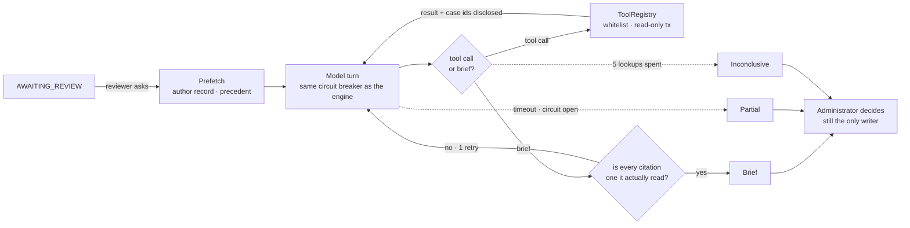

# Case investigation

A reviewer deciding a case can see the content, the engine's recommendation and
that case's own history. What they cannot see is whether this is the author's
first offence or their fourth, or how the same rule has been enforced before.
Cases are keyed by the content they concern, so until recently there was no path
from a person to their record at all.

This is an assistant that goes and finds out. It is optional, off by default,
reads only, and moves no case.

## What it is



Four read-only tools:

| Tool | Answers |
|---|---|
| `caseDetail` | this case's content and full audit trail |
| `authorHistory` | decisions already made about this author, 90 days |
| `similarResolvedCases` | what reviewers did under a rule, 90 days, plus how often reports under it were dismissed |
| `ruleText` | the wording and severity of one rule |

The first two are fetched before the model is asked anything. The case under
investigation is passed to every tool by the loop rather than named in the
model's arguments, so there is no way to point one at a different case.

## What is deliberately absent

**No memory.** The durable state is PostgreSQL, with transactions and an audit
trail behind it. A model's private second copy would be a second answer to
questions that must have exactly one — "has this author been actioned before" is
not a question two systems may disagree about.

**No retrieval over rules.** The rule set is a few dozen entries and fits in a
prompt with room to spare. A vector store would buy an embedding pipeline, a
service to run, and a new failure mode where the rule that mattered was not
retrieved and nothing reported it. *Decided cases* are a different corpus — they
grow without bound and retrieval over them is worth doing, once there are enough
of them; see [Next](#next).

**No autonomy on the main path.** `ModerationCaseProcessor` is unchanged. The
queue still runs a single-shot classifier scored against a 192-sample evaluation
set, and those numbers still mean what they meant.

**No writing.** The assistant recommends. `AdminModerationService.decide` remains
the only place content is removed or an account banned, as it has always been.
The read-only guarantee is a property of the database, declared on
`ToolRegistry.execute`, not a convention anyone has to keep true.

## How good is it

Measured on 16 scenarios, each run three times, against
`gemini-3.5-flash-lite`. A scenario is a situation — content, the author's
record, the precedent around it — because an investigation exists to answer
questions the content alone cannot.

```
mvn -Dtest=RealModelInvestigationBenchmarkTest -Dinvestigation.prompt=inv-v4 test
```

| | inv-v4 | inv-v5 |
|---|---|---|
| agreement — a moderator could defend it | 0.875 | 0.875 |
| exact — the single most likely outcome | 0.813 | 0.750 |
| stability — same answer every time | 0.938 | 0.938 |
| grounding — cited what the case turns on | 0.813 | 0.875 |
| cost | 1.0 lookups, ~2 100 prompt tokens | ~2 100 |

Four numbers rather than one, because an assistant fails in four ways a single
accuracy figure averages into nothing: wrong recommendation, right
recommendation for no stated reason, a different answer each time, or costing
more than it is worth.

**Known failures, reproducible:**

- **It will not be the first to escalate.** Expected `BAN` three times and
  recommended it once — only where a prior ban already existed. A repeat
  offender with two hides against precedent of bans comes back `HIDE`, and
  ungrounded: it does not cite the record it was supposed to reason from.
- **Precedent anchoring.** Ordinary student content, clean author, and 55% of
  that rule's reports dismissed and visible in the payload: still recommended
  for takedown, three times out of three. `inv-v5` was written for exactly this
  and did not move it, which is why it is registered and not chosen.

## Prompt versions

Every version stays registered; switching is one line of configuration
(`campusguard.moderation.investigator.prompt-version`). An unknown version stops
startup rather than falling back, because a brief attributed to wording that did
not write it is worse than no brief.

| Version | What changed, and why |
|---|---|
| `inv-v1` | First wording. |
| `inv-v2` | Describes what `NONE / HIDE / DELETE / BAN` actually do. v1 chose between four unexplained labels and landed on the middle one; it could never reach `NONE`. |
| `inv-v3` | Replaced the confidence number with a band. Seven briefs out of nine across v1 and v2 came back at exactly `0.85`, and the number was false precision anyway — the engine's confidence has an evaluation set behind it, this one never did. |
| **`inv-v4`** | Fetches the author's record and the precedent before the first turn instead of leaving them to the model. Took lookups from 2.7 to 1.0 and halved the tokens. **Current default.** |
| `inv-v5` | Says how to read the dismissal rate. Did not fix what it was for; a wash elsewhere. Registered, not chosen. |

## Cost

Every call is recorded in `ai_invocations` under its own engine name, so the
assistant's several calls per case stay out of the per-verdict figures the
evaluation set publishes.

```sql
select engine,
       count(*)                    as calls,
       round(avg(prompt_tokens))   as avg_prompt_tokens,
       round(avg(latency_ms))      as avg_ms
from ai_invocations
where created_at > now() - interval '30 days'
group by engine
order by engine;
```

A representative run: `investigator/inv-v4` at 2 268 prompt tokens and 3 586 ms
per call, against 622 tokens and 1 459 ms for a verdict — roughly 3.6×.

A case is investigated once and the brief is stored in `audit_log`; opening it
again is free. `?force=true` asks for a fresh look and is charged. One reviewer
may start 60 investigations an hour, which is the only place in this system
where a click spends money directly.

## Running it

```bash
INVESTIGATOR_ENABLED=true            # off by default
INVESTIGATOR_RUNS=1                  # above 1 votes across runs; see below
```

Both endpoints sit under `/api/admin/moderation-cases`, so the filter chain on
the `/api/admin` prefix restricts them:

- `GET /{id}/investigation` — the brief already held, or `204`
- `POST /{id}/investigate?force=false` — run it, or return the held one

With the assistant off, `POST` answers `503` with a sentence. The endpoint exists
either way, and the console greys the button out with the reason; any `4xx` would
read as the reviewer having done something wrong.

## Next

Ordered by what is blocking what.

1. **Measure consensus.** `INVESTIGATOR_RUNS=3` makes `EvidenceStrength` a count
   of how often repeated runs agreed rather than the model's grade of its own
   certainty. Implemented and unit-tested; the benchmark run that would have
   measured it exhausted the provider's quota. Until there is a number it stays
   at one.
2. **Retrieval over decided cases.** `similarResolvedCases` currently means "the
   five most recent under this rule". With a few hundred real decisions
   harvested it can mean "the five most similar", which is a far better signal
   and is the most plausible fix for the anchoring failure above.
3. **Collect the corpus.** `--campusguard.corpus.export=true` writes every
   decision a person has made, with how much they reconsidered it. It costs
   nothing to run and cannot be done retroactively. Note that `ESCALATE` is not
   derivable from a final action, so the export carries hardness signals as
   candidates for a person to label rather than inventing the class.
